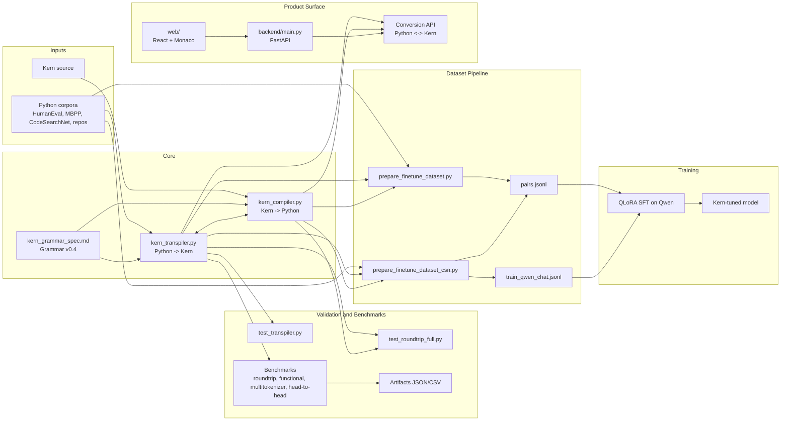
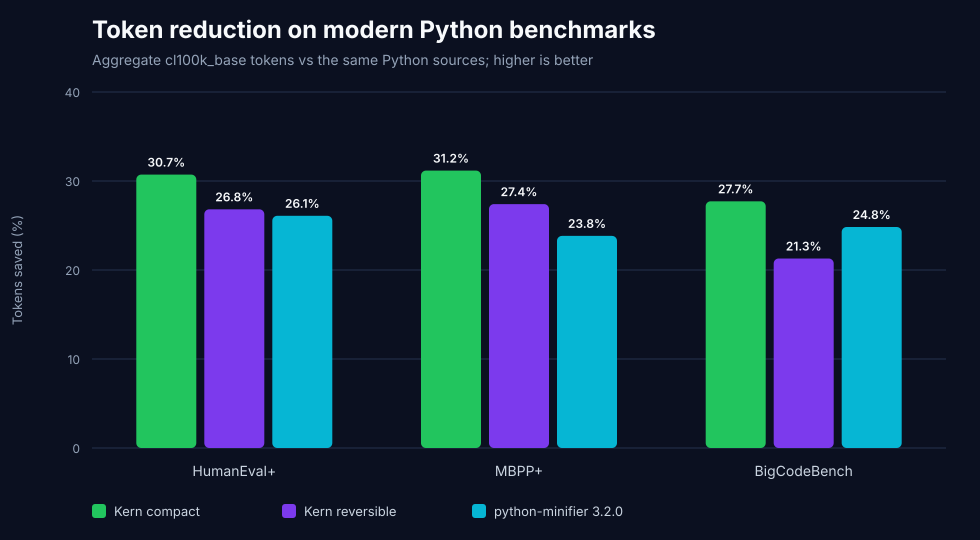
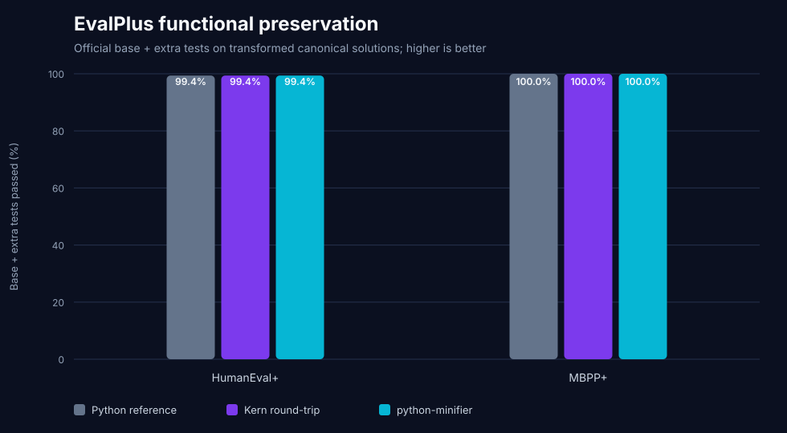

# Kern

Kern is a compact, reversible representation of Python designed for LLM workflows.

Core idea:
- `Python -> Kern` for token-efficient reasoning/edit loops.
- `Kern -> Python` for execution and ecosystem compatibility.
- Deterministic round-trip to preserve semantics.
- Optional `compact=True` mode for minifier-style local alpha-renaming while
  the default mode remains identifier-reversible.
- Project blog (live updates): `https://oscarcode9.github.io/kern-language.html`

## System architecture



## Current status (July 23, 2026)

Implemented:
- Grammar v0.4 (v0.2/v0.3 syntax remains accepted by the compiler)
- Transpiler: `kern_transpiler.py` (Python -> Kern)
- Optional compact profile: `kern_compact.py` (conservative local renaming)
- Inverse compiler: `kern_compiler.py` (Kern -> Python)
- Round-trip and functional benchmarks on HumanEval
- Multi-tokenizer benchmark on HumanEval + MBPP
- Unified head-to-head harness vs external baselines (SimPy, Token Sugar)
- Large-scale dataset builder from CodeSearchNet Python (`prepare_finetune_dataset_csn.py`)

## Modern benchmark (July 23, 2026)

Kern v0.4, including its new optional compact profile, was evaluated on the current
[EvalPlus](https://github.com/evalplus/evalplus) HumanEval+ and MBPP+ suites
and [BigCodeBench](https://github.com/bigcode-project/bigcodebench) v0.1.4.
The reproducible market baseline is
[python-minifier 3.2.0](https://pypi.org/project/python-minifier/).

This benchmark transforms known canonical solutions. It measures
representation density and preservation through `Python -> Kern -> Python`;
it is **not** a model-generation Pass@1 result.

Two Kern contracts are reported:

- **Kern reversible** is the default `transpile(source)` path and preserves
  source identifiers.
- **Kern compact** is opt-in with `transpile(source, compact=True)`. It keeps
  module-level names, entry points, and function parameters stable, but
  alpha-renames eligible function, lambda, and comprehension locals. Like a
  conventional minifier, it does not restore the original private identifiers.
  Renaming is disabled in scopes that use `dir`, `eval`, `exec`, `locals`, or
  `vars`.

### Protocol

- HumanEval+ `164`, MBPP+ `378`, BigCodeBench `1,140`;
- EvalPlus hashes: HumanEval+
  `fe585eb4df8c88d844eeb463ea4d0302`, MBPP+
  `ee43ecabebf20deef4bb776a405ac5b1`;
- BigCodeBench revision
  `b74c0d0bf70d2c0bc459be537895cca163007f1a`, split `v0.1.4`;
- Python `3.11.15`, EvalPlus `0.3.1`, python-minifier `3.2.0`,
  tiktoken `0.13.0`;
- Python references exclude benchmark prose and no-op docstrings while
  preserving the remaining source formatting;
- identical `cl100k_base` and `o200k_base` tokenizers for every local row;
- every task stays in the correctness denominator;
- EvalPlus runs the official base + extra tests; BigCodeBench is structural
  only because its 139-library suite requires an isolated execution sandbox.



`cl100k_base` aggregate results:

| Dataset | Python | Kern compact | Compact saved | Kern reversible | Reversible saved | python-minifier | Minifier saved |
|---|---:|---:|---:|---:|---:|---:|---:|
| HumanEval+ | `10,571` | **`7,398`** | **`30.02%`** | `7,736` | `26.82%` | `7,813` | `26.09%` |
| MBPP+ | `15,183` | **`10,620`** | **`30.05%`** | `11,023` | `27.40%` | `11,565` | `23.83%` |
| BigCodeBench | `163,786` | **`119,387`** | **`27.11%`** | `128,909` | `21.29%` | `123,107` | `24.84%` |
| Combined | `189,540` | **`137,405`** | **`27.51%`** | `147,668` | `22.09%` | `142,485` | `24.83%` |

Kern compact uses `5,080` fewer tokens than python-minifier across the three
corpora (`3.57%` fewer relative to the minified output). It wins each dataset
individually: `415` tokens on HumanEval+, `945` on MBPP+, and `3,720` on
BigCodeBench. The same ordering holds under `o200k_base`, where Kern compact
uses `4,614` fewer tokens overall.



Official EvalPlus base + extra-test preservation:

| Dataset | Python reference | Kern compact | Kern reversible | python-minifier |
|---|---:|---:|---:|---:|
| HumanEval+ | `163/164` | `163/164` | `163/164` | `163/164` |
| MBPP+ | `378/378` | `378/378` | `378/378` | `378/378` |
| Combined | `541/542` | `541/542` | `541/542` | `541/542` |

All four representations fail the same `HumanEval/32` numeric oracle in the
local runtime. Both Kern modes therefore preserve the Python reference outcome
on all `542/542` tasks; neither introduces a functional regression in EvalPlus.

On BigCodeBench, both Kern modes produced parseable Python for `1,128/1,140`
tasks and preserved their reference AST on `1,115/1,140` (`97.81%`). For
reversible mode the reference is the original normalized AST; for compact mode
it is the intentionally alpha-renamed compact AST. The 25 incompatibilities
remain explicit next targets: 16 attribute/call precedence cases, 8 f-string
cases, and 1 grouped-lambda case.

### Market context

| Project / benchmark | Public position | Comparison used here |
|---|---|---|
| Kern v0.4 reversible | Identifier-reversible compact Python representation | Reproduced locally with shared tokenizers, AST checks, and EvalPlus tests |
| Kern v0.4 compact | Optional semantic-minifier profile over the Kern grammar | Beats python-minifier on all three shared corpora and both shared tokenizers while matching its EvalPlus outcomes |
| [python-minifier 3.2.0](https://pypi.org/project/python-minifier/) | Python source-to-source minifier | Current PyPI release, reproduced on the same source, interpreter, and tokenizers |
| [Toke](https://www.tokelang.dev/) | Independent compiled language; reports 52% average reduction on 42 programs with its own trained BPE | Kept out of the graph because its corpus and tokenizer are not shared or reproduced here |
| [LiveCodeBench](https://livecodebench.github.io/) | Continuously updated code-generation benchmark | Planned for the model-generation phase, not a transpiler-preservation test |
| [SWE-bench](https://www.swebench.com/) | Repository-level issue resolution | Requires the same agent/model in Python and Kern modes; gold-patch compression would not be a valid comparison |

The earlier SimPy and Token Sugar table below remains a legacy comparison.
No claim is made that Kern beats Toke or code-generation models without a
shared corpus, tokenizer, model, prompt, and execution protocol.

### Reproduce

```bash
python -m venv .venv
.venv/bin/pip install -r benchmark-requirements.txt
.venv/bin/python benchmark_modern.py --run-functional --parallel 8
```

Artifacts:

- [`modern-benchmark-summary.json`](benchmark_results/modern/modern-benchmark-summary.json)
- [`modern-benchmark-details.csv`](benchmark_results/modern/modern-benchmark-details.csv)
- [`modern-token-efficiency.svg`](benchmark_results/modern/modern-token-efficiency.svg)
- [`modern-evalplus-correctness.svg`](benchmark_results/modern/modern-evalplus-correctness.svg)
- [`optimization-discovery-2026-07-23.md`](benchmark_results/modern/optimization-discovery-2026-07-23.md):
  measured candidates for the next compression iteration

## Latest update (March 5, 2026)

Training-data pipeline status:
- Built and validated a `20,000`-example Python -> Kern corpus from `code_search_net/python`.
- Scan stats: `21,825` scanned, `20,000` kept (`91.64%` keep rate), compile/parse validation enabled.
- Split: `19,000` train + `1,000` valid (`5%` validation ratio).
- Exported both pair format and chat format for Qwen SFT:
  - `data/finetune_csn20k/train/pairs.jsonl`
  - `data/finetune_csn20k/valid/pairs.jsonl`
  - `data/finetune_csn20k/train_qwen_chat.jsonl`
  - `data/finetune_csn20k/valid_qwen_chat.jsonl`
- Full run summary: `data/finetune_csn20k/summary.json`

Fine-tuning run #1 status (completed on March 5, 2026):
- Training completed on Colab `Tesla T4` with `Qwen/Qwen2.5-Coder-3B-Instruct` (QLoRA, T4-safe config).
- Run config: `5,000` train / `500` valid, `1` epoch, `313` steps, sequence length `512`.
- Final telemetry snapshot:
  - `train_runtime`: `5338s` (`~1h29m`)
  - `train_loss`: `5.313`
  - `eval_loss`: `8.483`
- Final adapter exported to:
  - `outputs/qwen-kern-qlora-t4/final_adapter`
- Published adapter (Hugging Face):
  - `https://huggingface.co/Oscarcode99/kern-qwen25-3b-lora-t4-run1`
- Next immediate step: evaluate `Pass@1` + round-trip/compile success against Python baseline.

## Grammar v0.4 optimization update (July 23, 2026)

The canonical emitter adds four more reversible compactions:

- function definitions omit `fn`: `build(x)=x`, `.method(x){...}`;
- final statement-block braces close implicitly at EOF;
- one-simple-statement suites use `:stmt`;
- same-name keyword arguments use `:x` for `x=x`.

Measured against v0.3 on all 20,000 examples in the original local
CodeSearchNet corpus:

| Tokenizer | Kern v0.3 | Kern v0.4 | Additional saving | Relative |
|---|---:|---:|---:|---:|
| `cl100k_base` | `1,977,185` | `1,911,630` | `65,555` | `3.32%` |
| `o200k_base` | `2,010,221` | `1,946,174` | `64,047` | `3.19%` |

Validation:

- v0.4 transpile/compile/parse success: `20,000/20,000`;
- no AST regressions against v0.3 on the independently audited v2 corpus;
- one pre-existing called-lambda precedence error is now corrected;
- HumanEval normalized AST and functional: `164/164`;
- HumanEval full prompt + canonical solution `cl100k_base`:
  `30,368 -> 7,908` (`73.96%` saved, including removed docstrings);
- `21/21` targeted v0.3/v0.4 regression tests and `13/13` executable
  round-trip cases pass.

The same iteration also hardens positional-only parameters, `async for/with`,
lambda defaults/call boundaries, dict/set expressions in headers, f-string
expression safety, and fail-fast handling for unmatched delimiters.

## Grammar v0.3 optimization update (July 23, 2026)

The canonical emitter now adds five reversible compactions:

- postfix null identity checks: `x?` / `x!`;
- compact returns and assign-return fusion: `>expr` / `>x=expr`;
- implicit method receivers: `fn .method(args){.attr...}`;
- separator elision after `}`-terminated compound statements;
- Python-safe expressions inside f-strings.

Measured against the previous emitter on the local CodeSearchNet 20k corpus
(19,998 cases where the v0.2 baseline also compiled):

| Tokenizer | Kern v0.2 | Kern v0.3 | Additional saving | Relative |
|---|---:|---:|---:|---:|
| `cl100k_base` | `2,026,215` | `1,976,878` | `49,337` | `2.44%` |
| `o200k_base` | `2,056,102` | `2,009,906` | `46,196` | `2.25%` |

Validation:

- v0.3 compile/parse success on the full corpus: `20,000/20,000`;
- v0.2-comparable compile/parse success: `19,998/19,998`;
- nested Boolean grouping, Ellipsis, and empty/single-tuple subscripts now
  reconstruct with their original AST shape;
- HumanEval normalized AST: `164/164`;
- HumanEval functional: `164/164`;
- HumanEval full prompt + canonical solution `cl100k_base`:
  `30,368 -> 8,245` (`72.85%` saved, including removed docstrings);
- cached HumanEval + MBPP normalized AST: `538/538`;
- cached HumanEval + MBPP corpus: `51,570 -> 24,416` (`52.66%` saved).

## Key results

### Correctness

| Metric | Result |
|---|---:|
| HumanEval round-trip parseable (`Python -> Kern -> Python`) | `164/164` |
| HumanEval AST equivalence (normalized) | `164/164` |
| HumanEval functional pass (`check(entry_point)`) | `164/164` |

### Token reduction

#### Grammar benchmark (synthetic, `cl100k_base`)

| Dataset | Python | Kern | Saved | Saved % |
|---|---:|---:|---:|---:|
| v0.2 grammar set (24 samples) | `464` | `349` | `115` | `24.8%` |

#### Large benchmark (538 samples total)

HumanEval (164) + MBPP train (374), all valid conversions (`538/538`):

| Tokenizer | Python | Kern | Saved | Saved % |
|---|---:|---:|---:|---:|
| `cl100k_base` | `51570` | `25659` | `25911` | `50.24%` |
| `o200k_base` | `51677` | `25906` | `25771` | `49.87%` |
| `llama_tinyllama` | `64311` | `32100` | `32211` | `50.09%` |
| `codegen_350m_mono` | `62157` | `32645` | `29512` | `47.48%` |

Per-dataset highlights:
- HumanEval + `cl100k_base`: `30368 -> 8873` (`70.78%` saved)
- MBPP train + `cl100k_base`: `21202 -> 16786` (`20.83%` saved)

### Head-to-head baseline comparison (official code adapters)

Run context:
- Datasets: HumanEval (164) + MBPP train (374) = 538
- Representations: `python`, `kern`, `simpy`, `token_sugar`
- Protocol: encode -> decode-to-python -> `ast.parse` + HumanEval functional check

`cl100k_base` overall results:

| Representation | Parse OK | HumanEval functional | Python tokens | Repr tokens | Saved % |
|---|---:|---:|---:|---:|---:|
| `kern` | `538/538` | `164/164` | `51570` | `25659` | `+50.24%` |
| `python` | `538/538` | `164/164` | `51570` | `51570` | `0.00%` |
| `simpy` | `526/538` | `156/164` | `49583`* | `59888` | `-20.78%` |
| `token_sugar` | `528/538` | `155/164` | `48592`* | `97481` | `-100.61%` |

*For baseline rows, token totals are computed on parse-valid samples only (same harness rule as all representations).

Statistical view (`overall`, `cl100k_base`, bootstrap 95% CI on saved %):
- `kern`: `50.244%` [`47.527`, `53.220`]
- `python`: `0.000%` [`0.000`, `0.000`]
- `simpy`: `-20.783%` [`-22.246`, `-19.384`]
- `token_sugar`: `-100.611%` [`-107.692`, `-94.196`]

Observed legacy-harness result:
- Across the evaluated HumanEval + MBPP train samples and four tokenizers,
  Kern preserved `538/538` parse results and `164/164` original HumanEval
  functional checks while reducing tokens by about `50%`. SimPy and Token
  Sugar were less robust and larger in this specific harness.

## Repository layout

- `kern_transpiler.py`: Python AST to Kern emitter
- `kern_compact.py`: optional conservative local alpha-renaming pass
- `kern_compiler.py`: Kern parser/compiler to Python
- `test_compact.py`: compact-profile scope and behavior regressions
- `test_transpiler.py`: transpiler smoke tests
- `test_roundtrip_full.py`: executable round-trip checks
- `test_optimizations.py`: v0.3/v0.4 grammar and backward-compatibility regressions
- `benchmark_grammar.py`: grammar-level token benchmark
- `benchmark_humaneval_roundtrip.py`: AST/parse round-trip benchmark
- `benchmark_humaneval_functional.py`: HumanEval functional validation
- `benchmark_multitokenizer.py`: HumanEval + MBPP multi-tokenizer benchmark
- `benchmark_head_to_head.py`: unified head-to-head harness (`python`, `kern`, optional external baselines)
- `analyze_head_to_head.py`: bootstrap confidence intervals over head-to-head metrics
- `test_baseline_adapters.py`: adapter sanity tests (`python`, `kern`, `simpy`, `token_sugar`)
- `prepare_finetune_dataset.py`: exports `.py` + `.kern` pairs and JSONL for fine-tuning
- `prepare_finetune_dataset_csn.py`: builds large filtered datasets from CodeSearchNet Python (streaming + Qwen chat export)

Generated benchmark artifacts:
- `humaneval_roundtrip_report.json`
- `humaneval_functional_report.json`
- `benchmark_multitokenizer_summary.csv`
- `benchmark_multitokenizer_summary.json`
- `benchmark_multitokenizer_details.json`
- `head_to_head_summary.csv`
- `head_to_head_summary.json`
- `head_to_head_details.json`
- `head_to_head_stats.csv`
- `head_to_head_stats.json`

## Quickstart

Install dependencies:

```bash
python3 -m pip install tiktoken human-eval datasets transformers sentencepiece rope tree-sitter regex tqdm
```

Install web/API dependencies:

```bash
python3 -m pip install -r backend/requirements.txt
cd web && npm install
```

Run tests:

```bash
python3 test_transpiler.py
python3 test_roundtrip_full.py
python3 -m unittest -v test_compact.py test_optimizations.py
python3 test_baseline_adapters.py
```

Run benchmarks:

```bash
python3 benchmark_grammar.py
python3 benchmark_humaneval_roundtrip.py
python3 benchmark_humaneval_functional.py
python3 benchmark_multitokenizer.py
python3 benchmark_head_to_head.py --datasets humaneval mbpp_train --tokenizers cl100k_base
python3 analyze_head_to_head.py
```

Run head-to-head with SimPy and Token Sugar adapters:

```bash
python3 benchmark_head_to_head.py \
  --datasets humaneval mbpp_train \
  --tokenizers cl100k_base o200k_base llama_tinyllama codegen_350m_mono \
  --include-simpy \
  --include-token-sugar
```

Build fine-tuning dataset (`.kern` + `.py` + JSONL):

```bash
python3 prepare_finetune_dataset.py \
  --datasets humaneval mbpp_train \
  --valid-ratio 0.05 \
  --seed 42 \
  --out-dir data/finetune_v1 \
  --overwrite
```

Build a larger, filtered `20k` dataset from CodeSearchNet Python (low disk usage via streaming):

```bash
python3 prepare_finetune_dataset_csn.py \
  --target-kept 20000 \
  --valid-ratio 0.05 \
  --out-dir data/finetune_csn20k \
  --overwrite
```

Output structure:

```text
data/finetune_v1/
  train/
    py/*.py
    kern/*.kern
    pairs.jsonl
  valid/
    py/*.py
    kern/*.kern
    pairs.jsonl
  summary.json
  rejected.jsonl
```

Large-run output structure (`data/finetune_csn20k`):

```text
data/finetune_csn20k/
  train/
    py/*.py
    kern/*.kern
    pairs.jsonl
  valid/
    py/*.py
    kern/*.kern
    pairs.jsonl
  train_qwen_chat.jsonl
  valid_qwen_chat.jsonl
  summary.json
  rejected_sample.jsonl
```

Run local web converter (React + FastAPI):

One-command mode (recommended):

```bash
./run_web_tool.sh
```

If `5173` or `8000` are busy, the script fails fast with the conflicting PID.
Free the port (or set `WEB_PORT` / `API_PORT`) and rerun.

From `web/` you can also run one command:

```bash
cd web
npm run dev
```

Manual mode:

Terminal 1 (API):

```bash
python3 -m uvicorn backend.main:app --reload --port 8000
```

Terminal 2 (frontend):

```bash
cd web
npm run dev:web
```

Open `http://localhost:5173` and use:
- `Python -> Kern` (`POST /api/convert/python-to-kern`)
- `Kern -> Python` (`POST /api/convert/kern-to-python`)
- `data/` sidebar explorer (`GET /api/files/list`, `GET /api/files/content?path=...`)
- Dark editor theme powered by Monaco (`@monaco-editor/react`, `vs-dark`)

## Notes

- `llama_tinyllama` is used as a practical tokenizer proxy for LLaMA-family tokenization.
- Benchmark scripts validate conversion before counting tokens (transpile, compile, and parse-back checks).
- `head_to_head_external_example.json` remains available if you want command-based custom adapters.
