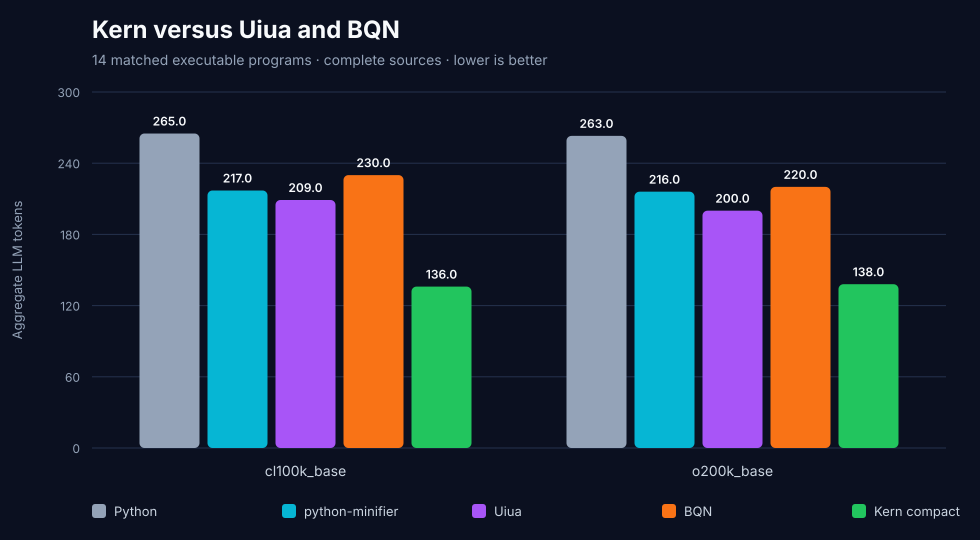
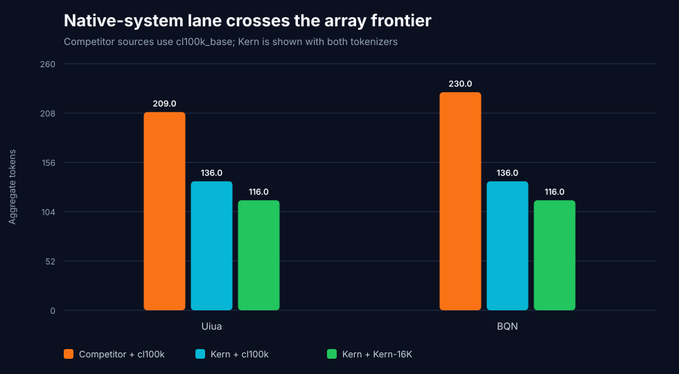
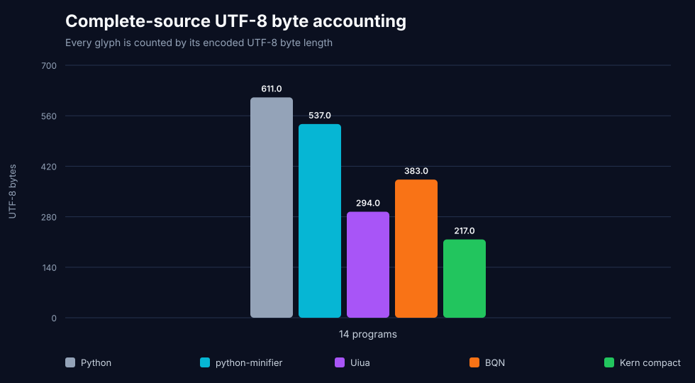
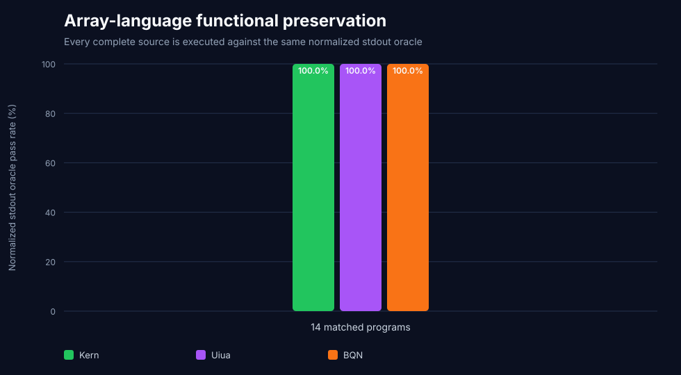

# Uiua and BQN compactness gate

This gate compares Kern with two modern array languages that were still open
after the K/J/GolfScript and Pyth/Jelly rounds:

- [Uiua 0.18.1](https://github.com/uiua-lang/uiua/releases/tag/0.18.1);
- [BQN](https://mlochbaum.github.io/BQN/) executed by
  [CBQN 0.12.0](https://github.com/dzaima/CBQN/releases/tag/v0.12.0).

It is a bounded density screen, not a claim that fourteen programs establish
global language superiority.

## Result

All representations execute all fourteen programs against the same normalized
stdout oracle. Complete source is counted, including explicit output code when
the runtime does not place the required value on stdout.

| Aggregate lane | Kern compact | Uiua | BQN |
|---|---:|---:|---:|
| Shared `cl100k_base` | **`136`** | `209` | `230` |
| Shared `o200k_base` | **`138`** | `200` | `220` |
| UTF-8 bytes | **`217`** | `294` | `383` |
| Separately labelled system lane | **`116` Kern-16K** | `209` cl100k | `230` cl100k |
| Exact stdout | **`14/14`** | `14/14` | `14/14` |

Under the neutral shared tokenizer, Kern is `34.93%` below Uiua and `40.87%`
below BQN. Kern also wins every individual pair (`14/14`) against both
languages under `cl100k_base`. Its decoded Python matches the compact contract
AST on `14/14`, and Kern-16K losslessly round-trips all `14/14` sources.









## Protocol

The fixed corpus covers arithmetic, reductions, text, arrays, a scalar dot
product, GCD, rotation, and an additive recurrence. It reuses the exact Python
programs and stdout oracles from the prior compact-language gates.

- Every full source and SHA-256 is published.
- `cl100k_base` and `o200k_base` count the same source strings for every
  language.
- UTF-8 bytes are a separate unit.
- Uiua uses `eval`; explicit `&p`/`≡&p` is retained where required to put the
  exact oracle value on stdout.
- CBQN uses its documented `-p` numeric and `-o` raw-string modes when they
  suffice. Array cases use `-e` plus explicit formatting. The selected mode is
  published beside each source and is not counted as language source.
- Display-only whitespace is collapsed; punctuation, values, and order are
  never removed.
- The competitor programs use documented primitives and execute successfully,
  but are not claimed to be globally shortest golf solutions.

## Runtime gates

| Runtime | Exact gate |
|---|---|
| Uiua | version `0.18.1`; arm64 binary SHA-256 `d4585363ebac31c6d63575108c13aff796fe86050f2b975ccff4f8bde22fd114` |
| CBQN | tag `v0.12.0`; commit `b4db324a99d6590d91b9b09bc36847f3254c1543`; binary SHA-256 `32c0915af389cc469cb3f663025d72c7aab39ca451d02de41b4c24f7b8e338e6` |
| Kern-16K | tokenizer SHA-256 `d570a49067b2fffca939924527b8daa3c0cc74e687b1ce7026c3193396e570ec` |

The harness rejects a runtime version, tag, commit, binary hash, or Kern
tokenizer hash mismatch before scoring.

## Optimizations discovered

The first honest run exposed three pair losses: BQN beat Kern on factorial and
GCD, while Uiua beat Kern on dot product. Two general reversible changes closed
all three:

1. `%value` and `&left:right` now carry an exact leading `import math`.
   The transpiler removes that import only when a compact math primitive is
   present, and the compiler restores it at the module boundary.
2. Literal scalar dot products can use `@1,2,3:4,5,6`; the compiler expands
   the strands and restores the canonical `a, b` generator.

The old named dot form remains accepted, and a math import is never removed
when no encoded primitive can restore it.

## Independent validation

The same implementation was rerun on the independent 1,682-program modern
corpus:

| Dataset | Programs | Kern compact `cl100k_base` | Contract AST |
|---|---:|---:|---:|
| HumanEval+ | `164` | `7,308` | `164/164` |
| MBPP+ | `378` | `10,412` | `378/378` |
| BigCodeBench | `1,140` | `118,306` | `1,115/1,140` |
| **Combined** | **`1,682`** | **`136,026`** | **`1,657/1,682`** |

The combined total is `6,461` tokens (`4.53%`) below python-minifier's
`142,487`. The frozen Kern-16K tokenizer losslessly decodes all `1,682`
sources, but its total is now `117,389`: the new surfaces were not in its
training vocabulary. This native regression is reported rather than hidden and
is a future tokenizer-training gate.

Official EvalPlus remains `163/164` HumanEval+ and `378/378` MBPP+ for Python,
Kern reversible, Kern compact, and python-minifier. All four representations
match Python's outcome on every one of the `542/542` tasks.

## Reproduce

Download the official macOS arm64 Uiua `0.18.1` release binary, then build the
pinned CBQN source:

```bash
git clone https://github.com/dzaima/CBQN /tmp/kern-cbqn
git -C /tmp/kern-cbqn checkout b4db324a99d6590d91b9b09bc36847f3254c1543
make -C /tmp/kern-cbqn CBQN

uv run \
  --with python-minifier==3.2.0 \
  --with tiktoken==0.13.0 \
  --with tokenizers==0.22.2 \
  python benchmark_array_languages.py \
  --uiua-binary /path/to/uiua \
  --cbqn-root /tmp/kern-cbqn \
  --bqn-binary /tmp/kern-cbqn/BQN
```

The published binary hashes are platform-specific; the version, tag, commit,
source corpus, and output oracles are portable protocol gates.

## Remaining market gates

This result closes Uiua and BQN only for this fixed corpus. It does not close
the market. The next high-risk families are:

1. Dyalog APL and another executable APL implementation;
2. Nibbles and CJam, whose encodings and stack semantics differ from the
   already-tested GolfScript/Pyth/Jelly group;
3. Vyxal, 05AB1E, Husk, and Brachylog;
4. q and another modern K-family implementation;
5. zerolang's graph and checked-edit representation, which needs a different
   protocol from source-only languages.

For code-page or nibble-based languages, native storage units must remain
separate from UTF-8 bytes and LLM-token counts.

## Artifacts

- `array-language-summary.json`: protocol, runtime gates, aggregates, and
  category totals;
- `array-language-corpus.json`: every complete Python, Uiua, and BQN source
  plus CBQN mode;
- `array-language-details.csv`: hashes, token counts, byte counts, and oracle
  results;
- four SVGs for neutral tokens, system lane, UTF-8 bytes, and execution.
