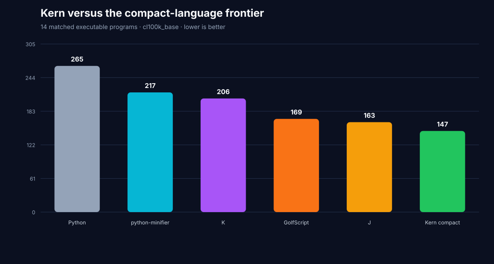
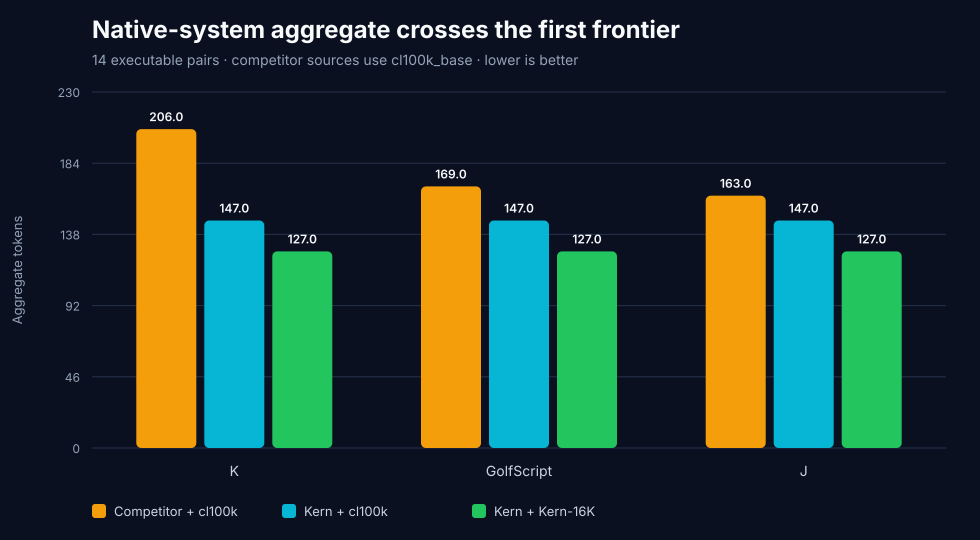
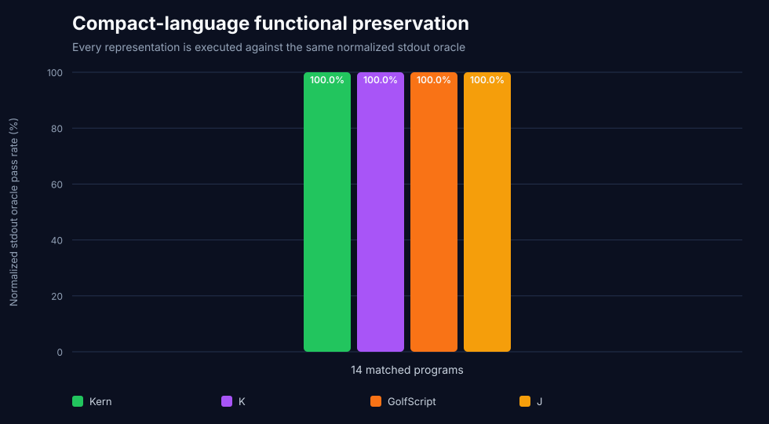

# Kern vs K, GolfScript, and J — executable token-density screen

This report compares Kern with the three languages at the top of the
[code.golf all-hole byte ranking](https://code.golf/rankings/langs/all/all/bytes)
snapshot checked on July 29, 2026: K, GolfScript, and J.

The leaderboard is a discovery signal, not the benchmark result. Its leading
solutions are private and it measures UTF-8 bytes rather than LLM tokens. This
screen instead publishes fourteen complete matched programs, executes every
language, and counts every source with the same production tokenizers.

## Result

Every implementation produced the expected normalized stdout on all `14/14`
programs. Kern also passed its compact-AST contract and exact native-tokenizer
round-trip on `14/14`.

### Shared production tokenizers

| Language | `cl100k_base` | `o200k_base` | Exact outputs |
|---|---:|---:|---:|
| **Kern compact** | **`147`** | **`149`** | **`14/14`** |
| J | `163` | `162` | `14/14` |
| GolfScript | `169` | `172` | `14/14` |
| K | `206` | `206` | `14/14` |
| python-minifier | `217` | `216` | `14/14` |
| Python | `265` | `263` | `14/14` |

Under `cl100k_base`, Kern is `28.64%` below K, `13.02%` below GolfScript, and
`9.82%` below J. It wins `13/14`, `9/14`, and `6/14` individual pairs,
respectively. The same aggregate ordering holds under `o200k_base`.

### Deployable system lane

Kern has a pinned native tokenizer; these three competitor artifacts do not
publish native LLM tokenizers. The system lane therefore compares Kern +
Kern-16K with each competitor + `cl100k_base` and is reported separately from
the neutral shared-tokenizer lane.

| Deployable language/tokenizer system | Tokens | Exact outputs |
|---|---:|---:|
| **Kern compact + Kern-16K** | **`127`** | **`14/14`** |
| J + `cl100k_base` | `163` | `14/14` |
| GolfScript + `cl100k_base` | `169` | `14/14` |
| K + `cl100k_base` | `206` | `14/14` |

On this fixed aggregate, Kern is `22.09%` below J, `24.85%` below GolfScript,
and `38.35%` below K.

### Complete-source UTF-8 bytes

| Language | UTF-8 bytes |
|---|---:|
| **Kern compact** | **`243`** |
| GolfScript | `260` |
| J | `277` |
| K | `286` |
| python-minifier | `537` |
| Python | `611` |

This is complete benchmark source, not code.golf's private best-known source.







## What changed in Kern

The adversarial runs exposed structural costs rather than isolated literals.
Kern compact now emits reversible array-language primitives only when the
Python AST matches the exact guarded shape:

- scalar and iterable output: `::value` and `$values`;
- reverse slices: `value~`;
- one-to-three-argument ranges: `!stop` and `!start:stop:step`;
- sum reductions and exact square generators: `+/values` and `*x:values`;
- sort and stable distinct: `^values` and `?values`;
- factorial and GCD: `%value` and `&left:right`;
- character/item counts: `values#item`;
- exact scalar dot products: `@a,b:left:right`;
- left rotation: `values<<<amount`;
- integer palindrome predicates: `=~value`;
- seeded second-order additive recurrence plus output:
  `$values=[seed0,seed1]\iterations`.

The compiler expands every form back to ordinary Python. Near matches retain
their original spelling, and the default reversible emitter is unchanged.

The same changes were rerun on the independent 1,682-program modern corpus:

| Dataset | Previous Kern compact | Current | Additional `cl100k_base` saving |
|---|---:|---:|---:|
| HumanEval+ | `7,324` | **`7,308`** | `16` |
| MBPP+ | `10,451` | **`10,415`** | `36` |
| BigCodeBench | `118,395` | **`118,306`** | `89` |
| **Combined** | **`136,170`** | **`136,029`** | **`141`** |

HumanEval+ and MBPP+ preserve their compact AST contracts on every task.
BigCodeBench keeps the same `1,115/1,140` contract count and
`1,129/1,140` parseable results. Official EvalPlus remains `163/164`
HumanEval+ and `378/378` MBPP+ for Python, Kern, Kern compact, and
python-minifier; all representations preserve the same `542/542` outcomes.

## Protocol

The corpus covers five visible categories: two scalar programs, two
reductions, three text programs, six array programs, and one recurrence.

For each pair, the harness:

1. executes the Python source as the output oracle;
2. emits, compiles, and executes Kern compact;
3. executes python-minifier, K, GolfScript, and J;
4. collapses display-only whitespace while preserving values and order;
5. requires exact normalized stdout;
6. counts every complete source under `cl100k_base` and `o200k_base`;
7. counts Kern separately under the held-out Kern-16K tokenizer;
8. publishes sources, hashes, runtime gates, details, and totals.

Pinned runtime evidence:

| Runtime | Pin / gate |
|---|---|
| code.golf discovery repository | `2c0fc35ca0f76a2a6c7faaf4d32f21244a359a95` |
| ngn/k | `717063f24921d5aff405a39cf7643efedb5bb365` |
| GolfScript | `6155e9f7860775be53bdc79c6e1c3b9308ebbfe5`; script SHA-256 `c3d9800af812146c0215a8a61aa5fee615ccdb1bed3a3ff5f64b8b4e0a28c25e` |
| J | `9.6.3`; runtime version checked at execution |
| Kern-16K | SHA-256 `d570a49067b2fffca939924527b8daa3c0cc74e687b1ce7026c3193396e570ec` |

Platform-specific K and J executable hashes are recorded in
`compact-language-summary.json`.

## Reproduce

```bash
git clone https://codeberg.org/ngn/k.git /tmp/kern-k
git -C /tmp/kern-k checkout 717063f24921d5aff405a39cf7643efedb5bb365
make -C /tmp/kern-k

curl -L \
  https://raw.githubusercontent.com/lynn/golfscript/6155e9f7860775be53bdc79c6e1c3b9308ebbfe5/golfscript.rb \
  -o /tmp/golfscript.rb
chmod +x /tmp/golfscript.rb
```

Install the official J `9.6.3` runtime for the host platform, then run:

```bash
uv run \
  --with python-minifier \
  --with tiktoken \
  --with tokenizers \
  python benchmark_compact_languages.py \
  --k-root /tmp/kern-k \
  --golfscript /tmp/golfscript.rb \
  --j-binary /path/to/j9.6/bin/jconsole \
  --ruby /usr/bin/ruby

uv run \
  --with python-minifier \
  --with tiktoken \
  --with tokenizers \
  python -m unittest -v \
  test_compact_languages_benchmark.py \
  test_golf_languages_benchmark.py \
  test_optimizations.py
```

The GolfScript runner supplies Ruby's `ASCII-8BIT` source mode and rejects a
script whose SHA-256 does not match the pin.

## Limits

This is a bounded executable screen, not proof that Kern is the smallest
language in the world.

- Competitor programs are benchmark-authored from documented primitives; they
  are not claimed to be globally minimal or authored by each language's best
  golfer.
- code.golf's leading sources are private, so they cannot be recounted as LLM
  tokens.
- The corpus is small and contains six array tasks; category totals remain
  public.
- Aggregate wins do not mean Kern wins every pair: against J the neutral lane
  is only `6/14`.
- The separate Pyth/Jelly screen remains harder: both lead Kern under shared
  tokenizers and in bytes, although Kern-16K wins its bounded system aggregate.
- No code-generation model is evaluated here.

Expert review, corpus expansion, Uiua, BQN, and zerolang remain open market
gates.

## Artifacts

- `compact-language-summary.json`: metadata, gates, aggregates, and categories;
- `compact-language-corpus.json`: all matched sources and expected outputs;
- `compact-language-details.csv`: per-program hashes, tokens, and correctness;
- `compact-language-token-density.svg`: shared-tokenizer comparison;
- `compact-language-native-system.svg`: separate native-system comparison;
- `compact-language-functional.svg`: complete functional denominator.
