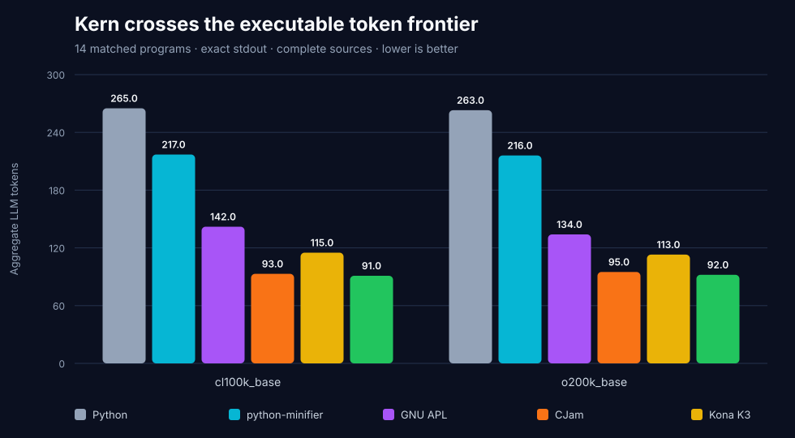
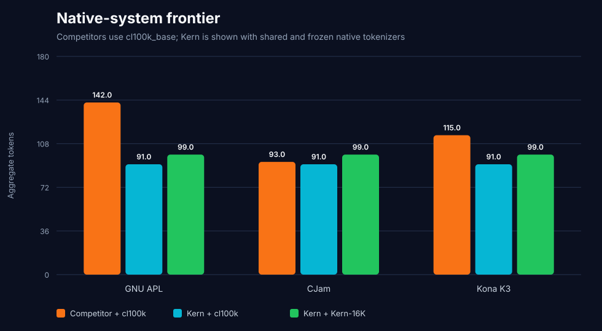
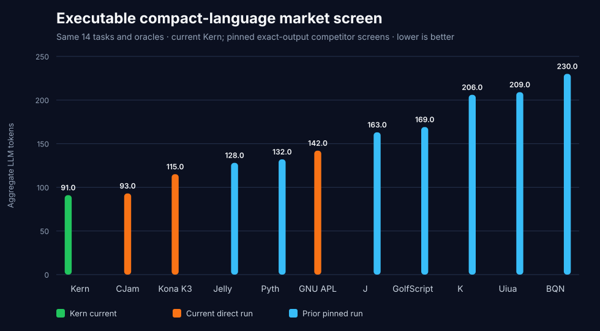
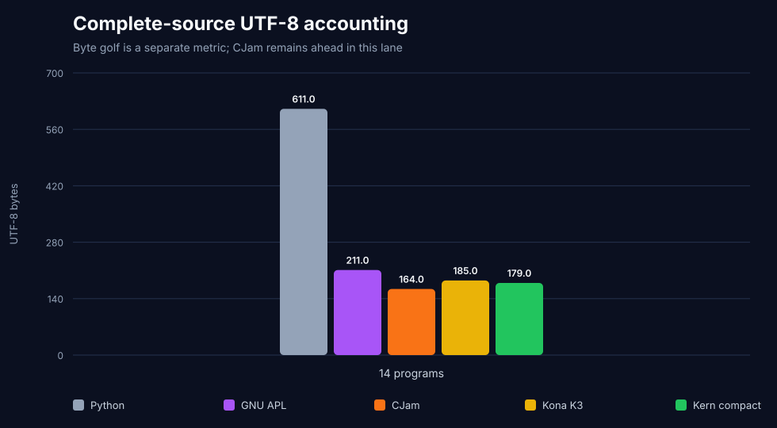
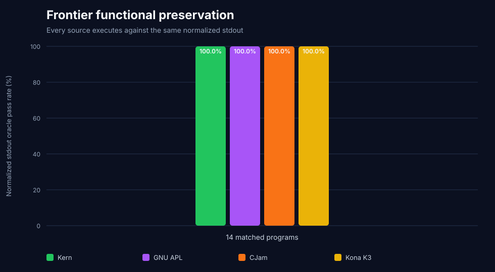

# Executable token frontier — August 1, 2026

This screen adds three compact-language families that were missing from the
earlier market audit: GNU APL 2.0, CJam 0.6.5, and Kona K3. It executes fourteen
complete matched programs against identical normalized-stdout oracles and
publishes every source, hash, runtime gate, shared-tokenizer count, native Kern
count, and UTF-8 byte count.

The bounded result is:

> Kern compact is the `cl100k_base` aggregate leader on this fourteen-program
> corpus at **91 tokens**, narrowly ahead of CJam at **93**. CJam remains the
> UTF-8 byte leader and also beats Kern's frozen native tokenizer.

## Results

| Complete-source aggregate | Kern compact | CJam 0.6.5 | Kona K3 | GNU APL 2.0 | Python | python-minifier |
|---|---:|---:|---:|---:|---:|---:|
| `cl100k_base` | **`91`** | `93` | `115` | `142` | `265` | `217` |
| `o200k_base` | **`92`** | `95` | `113` | `134` | `263` | `216` |
| UTF-8 bytes | `179` | **`164`** | `185` | `211` | `611` | `537` |
| Exact stdout | `14/14` | `14/14` | `14/14` | `14/14` | `14/14` | `14/14` |

Kern is `2.15%` below CJam, `20.87%` below Kona, and `35.92%` below GNU APL
in the neutral `cl100k_base` aggregate. The CJam margin is narrow and not
uniform: Kern wins only `5/14` individual CJam pairs, and its median per-pair
comparison is `16.67%` worse. The aggregate lead is therefore real for this
fixed corpus, but it is not evidence that Kern dominates CJam generally.



## Native-system lane

Kern's newly trained frozen Kern-16K tokenizer uses `99` tokens on the same
sources. This complete-system lane beats GNU APL + cl100k (`142`) and Kona +
cl100k (`115`), but CJam + cl100k remains `6.45%` smaller (`93`). Different
tokenizers are deliberately labeled because this lane measures deployable
systems, not grammar alone.



## Same-corpus market view

The prior pinned K/GolfScript/J, Pyth/Jelly, and Uiua/BQN screens use the exact
same fourteen task IDs, Python sources, and stdout oracles. The new harness
verifies that registry equality before joining their already published `14/14`
competitor results to the current Kern score. On that bounded union, Kern's
`91` shared tokens are below every currently executed competitor; CJam at `93`
is the closest.



This joined view refreshes Kern while preserving the pinned competitor sources
and executions. It does not imply that those sources are globally minimal or
replace the separate runtime reports.

## Bytes are a separate contest

CJam uses `164` complete-source UTF-8 bytes, ahead of Kern's `179`. Kern is not
the byte-golf leader on this corpus. GNU APL's glyphs are counted as UTF-8
bytes, not as a one-byte private code page.



## Correctness and runtime gates

Every representation executes and matches the same oracle on all `14/14`
programs. Kern additionally reconstructs the expected compact Python AST on
`14/14`, and Kern-16K decodes each source exactly on `14/14`.



The harness refuses to score unpinned runtimes:

- GNU APL is built from the official 2.0 archive, SHA-256
  `24bbb744fce47e62837234a053bdeecee51b9ea61c82c79f7cc191bc6a54c0a1`.
  Its observed binary hash is reported but is not the reproducibility gate,
  because the build embeds its date and platform.
- CJam uses the official 0.6.5 JAR from changeset
  `c62f1221dfadd63f3b21776714f62573df24dd32`, SHA-256
  `e7444a9ac3cab491053df2bd625217906ba07ab091ace9aa52e54f700db9e3a7`.
- Kona is checked out at commit
  `ac4e4c515faf586520454c266619ce1fea650554`; its upstream suite reports
  `1,101` passed, `33` skipped, and `0` failed before scoring. Its observed
  binary hash is informational because the build embeds its date.
- Kern-16K is gated by SHA-256
  `14402547477aecf3b4cc8015180f125e19ab66c20d220b82537ab869e9180c82`.

The scored Kona GCD program is a fixed-input Euclidean spelling. Replacing it
with a general recursive spelling changes Kona's totals from `115/113/185` to
`123/121/195` (`cl100k` / `o200k` / bytes); both values are disclosed to make
the sensitivity visible.

## Scope and open challengers

These are benchmark-authored, adversarially tightened programs using documented
primitives. They are not certified best-known expert submissions. The corpus
is small and has six array tasks, so aggregate ordering may change with a
larger or differently balanced suite.

Dyalog APL 20 was inspected but not silently substituted for GNU APL: its
official distribution and license require a separate system-install gate.
Nibbles 1.01 was also inspected, but no reliable executable was obtained in
this environment; its runtime gate remains open and no score is invented.
Vyxal has since passed a separate official-JAR and code-page gate on all
fourteen tasks; its [dedicated report](../vyxal/README.md) publishes that
result. 05AB1E, Husk, Brachylog, and other active golf languages remain in the
expansion queue. Consequently this report supports a bounded corpus lead, not
a global “world champion” claim.

Official references: [GNU APL](https://www.gnu.org/software/apl/),
[CJam 0.6.5 source](https://sourceforge.net/p/cjam/code/ci/0.6.5/tree/),
[CJam operators](https://sourceforge.net/p/cjam/wiki/Operators/), and
[Kona](https://github.com/kevinlawler/kona). Open gates are tracked against
[Nibbles](https://github.com/darrenks/nibbles) and
[Dyalog APL 20](https://www.dyalog.com/dyalog/dyalog-versions/200.htm). The
executed next-stage reference is [Vyxal 3.12.0](../vyxal/README.md).

## Reproduce

Build or obtain the pinned runtimes above, then run:

```bash
.venv/bin/python benchmark_frontier_languages.py \
  --gnu-apl-binary /path/to/apl \
  --gnu-apl-source-archive /path/to/apl-2.0.tar.gz \
  --cjam-jar /path/to/cjam-0.6.5.jar \
  --kona-root /path/to/kona
```

Artifacts:

- `frontier-language-summary.json`: runtime gates, aggregates, comparisons,
  category totals, and limitations;
- `frontier-language-corpus.json`: every complete source and oracle;
- `frontier-language-details.csv`: every source hash, score, and correctness
  gate;
- five SVGs covering shared tokens, the same-corpus market, native systems,
  bytes, and correctness.
