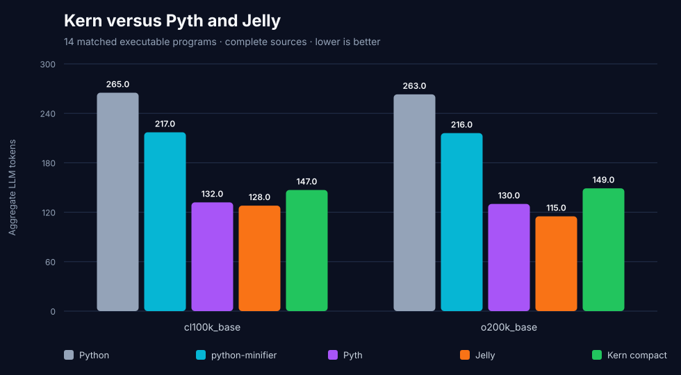
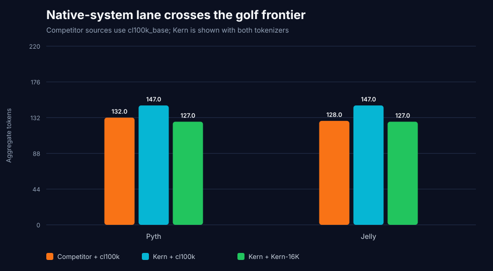
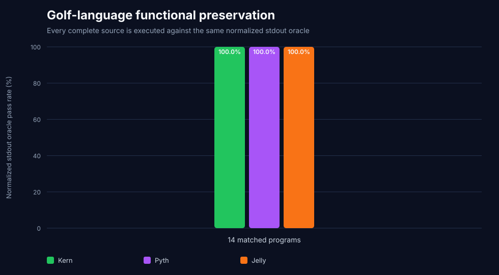
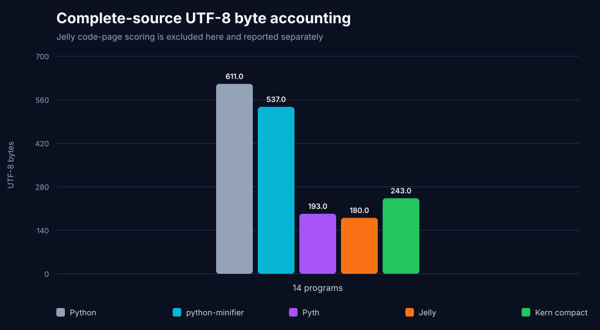

# Kern vs Pyth and Jelly — executable adversarial density screen

Pyth and Jelly are dedicated golfing languages with far denser built-in
semantics than ordinary Python. This report compares them with Kern on the
same fourteen complete executable programs used by the K/GolfScript/J screen.
It is a representation-density benchmark, not a code-generation benchmark.

Every Python, Kern, python-minifier, Pyth, and Jelly source produced the exact
expected normalized stdout on `14/14` programs. Kern also passed its compact
AST contract and native-tokenizer exact round-trip on `14/14`.

## Neutral shared-tokenizer result

| Representation | `cl100k_base` | `o200k_base` | Exact outputs |
|---|---:|---:|---:|
| Jelly | **`128`** | **`115`** | `14/14` |
| Pyth | **`132`** | **`130`** | `14/14` |
| **Kern compact** | `147` | `149` | **`14/14`** |
| python-minifier | `217` | `216` | `14/14` |
| Python | `265` | `263` | `14/14` |

Kern does not win the neutral lane. Under `cl100k_base`, it is `11.36%` above
Pyth and `14.84%` above Jelly. It wins `4/14` individual Pyth pairs and `5/14`
Jelly pairs.

## Deployable system lane

Pyth and Jelly do not ship a production LLM tokenizer in the evaluated
artifacts. Kern's separately trained and held-out Kern-16K tokenizer is
therefore compared against their complete sources under `cl100k_base`.

| Deployable language/tokenizer system | Tokens | Exact outputs |
|---|---:|---:|
| **Kern compact + Kern-16K** | **`127`** | **`14/14`** |
| Jelly + `cl100k_base` | `128` | `14/14` |
| Pyth + `cl100k_base` | `132` | `14/14` |

Kern wins this bounded aggregate by one token against Jelly (`0.78%`) and five
against Pyth (`3.79%`). It wins `6/14` individual Jelly pairs and `7/14` Pyth
pairs, so the aggregate result is narrow and not universal.







## Byte and code-page accounting

| Representation | Complete UTF-8 bytes |
|---|---:|
| Jelly | **`180`** |
| Pyth | **`193`** |
| **Kern compact** | `243` |
| python-minifier | `537` |
| Python | `611` |

Jelly's traditional golf score uses its official 256-character code page. All
published Jelly source characters pass that gate and occupy `145` code-page
units. That number is reported separately: it is not UTF-8 bytes and is not an
LLM token count.



## Kern optimizations discovered by the screen

The initial honest run was Kern `200`, Pyth `132`, and Jelly `128` under
`cl100k_base`; Kern-16K used `159`. The final Kern sources use general,
reversible primitives for:

- compact ranges and sum reductions;
- sort, stable distinct, and elementwise square generators;
- factorial, GCD, count, and scalar dot product;
- left rotation and integer palindrome predicates;
- a fused seeded second-order additive recurrence that preserves the assigned
  Python binding and reconstructs the complete loop.

The final run reduces Kern to `147` shared tokens and `127` Kern-16K tokens.
No constant folding, precomputed answers, oracle-specific literals, or
whitespace-only output normalization was used.

The optimizations were also tested on the independent modern corpus:

| Dataset | Programs | Kern compact `cl100k_base` | Contract AST |
|---|---:|---:|---:|
| HumanEval+ | `164` | `7,308` | `164/164` |
| MBPP+ | `378` | `10,415` | `378/378` |
| BigCodeBench | `1,140` | `118,306` | `1,115/1,140` |
| **Combined** | **`1,682`** | **`136,029`** | **`1,657/1,682`** |

Kern compact is `6,458` tokens (`4.53%`) below python-minifier on the combined
modern corpus. Official EvalPlus remains `163/164` HumanEval+ and `378/378`
MBPP+ for every Python-derived representation, preserving all `542/542`
reference outcomes.

## Runtime gates

| Runtime | Exact gate |
|---|---|
| Pyth | commit `97cdf30d749d2a0d6ec1bb4b9bc417c34cce05bb`; interpreter SHA-256 `2a7f166cd9e5db43bd0ef8130d28c7813aa61ee7a3caff55f25afb0581d2ca6a`; Python `3.8.20` |
| Jelly | commit `70c9fd93ab009c05dc396f8cc091f72b212fb188`; interpreter SHA-256 `b6ff8d28c77ea153876594acf2ce0c35d2a5177136816ea56f01ee3b330a9af5`; package `0.1.31`; Python `3.12.11`; SymPy `1.14.0` |
| Kern-16K | SHA-256 `d570a49067b2fffca939924527b8daa3c0cc74e687b1ce7026c3193396e570ec` |

Pyth's current interpreter still imports the removed `fractions.gcd`; Python
`3.8.20` is pinned so its documented GCD primitive can execute without
patching upstream source. Jelly's installed interpreter hash must equal the
pinned repository file.

## Reproduce

```bash
git clone https://github.com/isaacg1/pyth /tmp/kern-pyth
git -C /tmp/kern-pyth checkout 97cdf30d749d2a0d6ec1bb4b9bc417c34cce05bb

git clone https://github.com/DennisMitchell/jellylanguage /tmp/kern-jelly
git -C /tmp/kern-jelly checkout 70c9fd93ab009c05dc396f8cc091f72b212fb188

uv venv /tmp/kern-pyth-venv --python 3.8.20
uv venv /tmp/kern-jelly-venv --python 3.12.11
uv pip install --python /tmp/kern-jelly-venv/bin/python sympy==1.14.0
uv pip install --python /tmp/kern-jelly-venv/bin/python \
  --no-deps /tmp/kern-jelly

uv run \
  --with python-minifier \
  --with tiktoken \
  --with tokenizers \
  python benchmark_golf_languages.py \
  --pyth-root /tmp/kern-pyth \
  --pyth-python /tmp/kern-pyth-venv/bin/python \
  --jelly-root /tmp/kern-jelly \
  --jelly-python /tmp/kern-jelly-venv/bin/python \
  --jelly-binary /tmp/kern-jelly-venv/bin/jelly
```

The harness rejects commit, interpreter-hash, Python-version, tokenizer-hash,
and Jelly code-page failures before scoring.

## Limits and next gates

- Fourteen programs are enough to expose syntax costs, not to establish global
  language superiority.
- Competitor sources are benchmark-authored from official primitives and are
  not certified best-known golf solutions.
- Pyth and Jelly still win the shared-tokenizer and byte lanes.
- Kern's native aggregate win is only one token over Jelly.
- Expert review, a larger and less array-heavy corpus, Uiua `0.18.1`, BQN via
  CBQN `0.12.0`, and zerolang remain open gates.
- No generation model, Pass@k, or agent task is measured here.

## Artifacts

- `golf-language-summary.json`: protocol, gates, aggregates, and categories;
- `golf-language-corpus.json`: every Python, Pyth, and Jelly source;
- `golf-language-details.csv`: hashes, tokens, bytes, and oracle results;
- `golf-language-token-density.svg`: neutral tokenizer totals;
- `golf-language-native-system.svg`: separately labeled system lane;
- `golf-language-utf8-bytes.svg`: complete UTF-8 source accounting;
- `golf-language-functional.svg`: full functional denominator.
