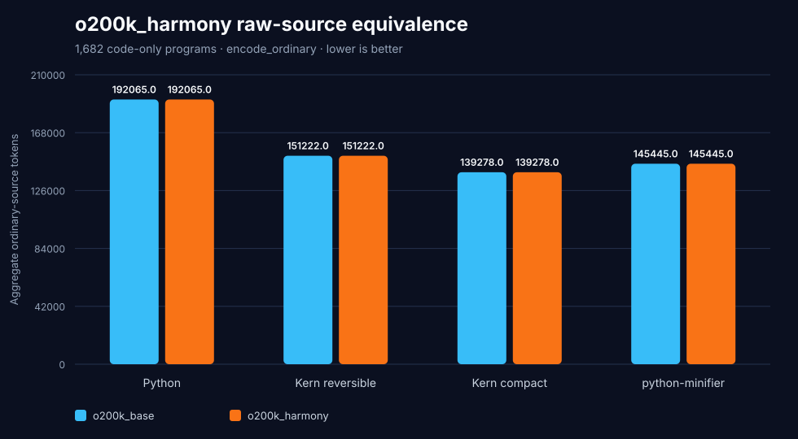

# o200k_harmony source-token audit — August 1, 2026

`o200k_harmony` is available in the pinned local `tiktoken 0.13.0`, so Kern can
be measured against it directly. The important result is simpler than a new
leaderboard:

> For ordinary source code, `o200k_harmony` and `o200k_base` produce exactly
> the same token IDs and token counts.

Harmony adds special message/control tokens. It does not replace the ordinary
text segmentation used by `o200k_base` in this version.

## Full modern-corpus result

The audit scores Python, reversible Kern, compact Kern, and python-minifier on
all `1,682` code-only programs from HumanEval+, MBPP+, and BigCodeBench.

| Representation | `o200k_base` | `o200k_harmony` | Difference |
|---|---:|---:|---:|
| Python | `192,065` | `192,065` | **`0`** |
| Kern reversible | `151,222` | `151,222` | **`0`** |
| **Kern compact** | **`139,278`** | **`139,278`** | **`0`** |
| python-minifier | `145,445` | `145,445` | **`0`** |

Kern compact remains `6,167` tokens (`4.24%`) below python-minifier under
`o200k_harmony`, exactly matching the existing `o200k_base` result.



## Strong equality gate

This is not only an aggregate tie:

- all `6,728/6,728` representation rows have identical `o200k` token IDs;
- aggregate token delta is `0`;
- maximum per-program absolute token delta is `0`;
- the tokenizer regex pattern is identical;
- all ordinary mergeable ranks are identical and share SHA-256
  `dcf8f06c59a061f59909285da2f0fbbc0fa772916ad5f0b4ed52ce6a1c32d04a`.

The constructor audit is pinned to `tiktoken 0.13.0`. Its installed
`tiktoken_ext.openai_public.o200k_harmony` implementation has SHA-256
`954392738e60d0fb6dca1dad80872efc47c8e2733babecbbf0a23970ed66c2cb`.

## What Harmony changes

The vocabulary grows from `200,019` to `201,088` entries because Harmony adds
message and control tokens. The audited markers—including `<|start|>`,
`<|channel|>`, `<|message|>`, `<|call|>`, and `<|end|>`—each encode as one
token when explicitly allowed as special tokens. Treated as ordinary text,
they use the same five-to-seven token sequences under both o200k encodings.

This benchmark intentionally calls `encode_ordinary`. It measures programming
language source density and does **not** invent a chat-message envelope. A
future end-to-end prompt benchmark must pin the exact message serializer,
roles, channels, tool calls, and special-token policy; that overhead is a
different measurement from the language itself.

No public OpenAI documentation page describing `o200k_harmony` was located
during this audit. The reproducibility contract therefore comes from the
installed OpenAI `tiktoken` package source and is recorded with its version and
hash rather than inferred from a model name.

## Reproduce

```bash
.venv/bin/python benchmark_harmony.py
```

Artifacts:

- `harmony-summary.json`: dataset pins, encoding contract, special-token
  probes, equality gates, and aggregate totals;
- `harmony-details.csv`: all `6,728` source hashes and token counts;
- `harmony-token-density.svg`: the complete modern-corpus comparison.
