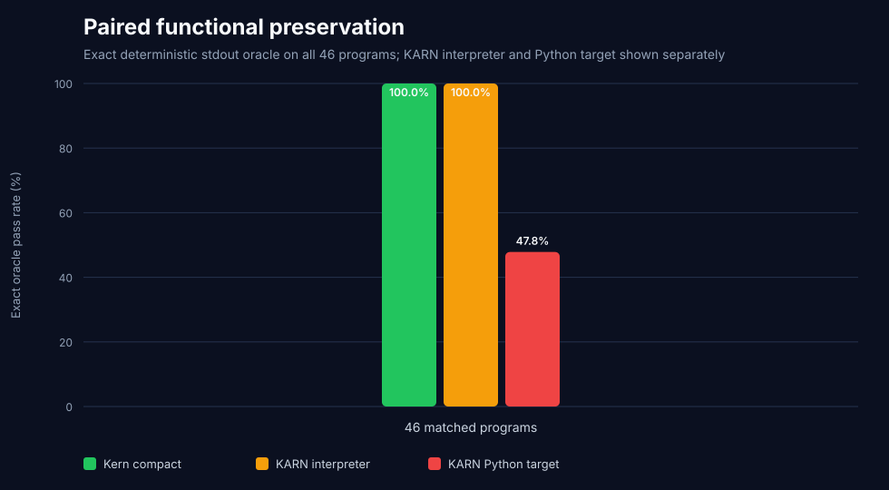

# Kern vs KARN v1.0.0 — paired audit, July 29, 2026

KARN publicly describes itself as four times denser than Python and claims
`76%` fewer tokens for equivalent logic. This audit pins commit
`5208a5f592083c4885281b1d505af06fc58995ba`, verifies its compiler, audits the
published claim artifacts, and runs a full-denominator paired comparison.

## Result

On 46 matched executable programs derived from KARN's three deterministic
public examples, its public interpreter conformance suite, and seven extended
probes of documented features:

| `cl100k_base` | Tokens | Saved vs Python |
|---|---:|---:|
| Python | `813` | baseline |
| **Kern compact** | **`670`** | **`17.59%`** |
| python-minifier | `674` | `17.10%` |
| KARN | `685` | `15.74%` |

Kern compact uses `15` fewer shared-tokenizer tokens than KARN: **`2.19%`
below KARN**. Kern wins `18/46` individual programs, KARN wins `13/46`, and 15
tie. The median pair is a tie, so this is a small aggregate language-density
win rather than a claim that Kern is smaller on every tiny expression.

Under `o200k_base`, Kern uses `676` tokens and KARN `686`, leaving Kern
`1.46%` smaller. python-minifier uses `673`.


## Complete-system lane

KARN does not publish a purpose-built LLM tokenizer. In the deployable system
lane, Kern compact + Kern‑16K uses `533` tokens versus KARN +
`cl100k_base` at `685`: **22.19% fewer**.

This native row is not presented as tokenizer-neutral; the shared
`cl100k_base` and `o200k_base` rows above are the neutral grammar comparison.
Kern‑16K exactly reconstructs all `46/46` Kern representations.

On only KARN's three deterministic public examples:

| System | Tokens |
|---|---:|
| **Kern + Kern‑16K** | **`114`** |
| Kern + cl100k | `145` |
| KARN + cl100k | `167` |

Kern is `13.17%` below KARN with the shared tokenizer and `31.74%` below it
in the complete-system lane on those public examples.

## Functional gates

Every representation stays in the denominator and must match a fixed stdout
oracle:

| Gate | Exact output |
|---|---:|
| Python reference | `46/46` |
| **Kern compact round-trip** | **`46/46`** |
| python-minifier | `46/46` |
| **KARN interpreter** | **`46/46`** |
| KARN Python target | `22/46` |

KARN's interpreter is strong on the features it publicly tests: all 46 paired
programs parse and match their oracle. Its Python target emits a file for all
46, but 17 generated files fail during parse or execution and seven more
produce the wrong output. Recursion/functions return `None`, tagged results
and several standard-library names are missing, map keys become unresolved
identifiers, match generation can emit invalid Python, and KARN collection
methods are copied to Python objects without translation.



The repository's own suite independently passes `91/91`, and all seven
official `.kn` examples pass the `karn check` command. The implementation of
that command invokes only the lexer and parser; despite its CLI description,
it does not call a separate type checker.

## Audit of the 76% claim

KARN's documentation describes the same REST API as approximately 47 KARN
tokens versus 198 Python tokens, but:

- it does not identify a tokenizer;
- neither paired source is published alongside those numbers;
- `47` and `198` occur only as approximate values in `docs.html`;
- the repository contains no `cl100k`, `tiktoken`, or token-counting script;
- the shorter current README KARN snippet uses `72` `cl100k_base` tokens;
- the current `examples/api-server.kn`, with comments removed, uses `118`
  `cl100k_base` tokens.

The claim's exact `47/198` row therefore cannot be reproduced. On the public,
matched, executable 46-program corpus, KARN reduces Python by `15.74%`, not
`76%`. This does not prove no unpublished corpus could produce a larger
reduction; it means the public artifacts do not substantiate the advertised
number.

KARN's README also reports approximate tokens per line of code. Tokens/LOC
cannot establish language-level compression without matched programs, an
identified tokenizer, and equivalent behavior.

## Corpus and protocol

- 46 fixed pairs are embedded in `benchmark_karn.py` and exported to
  `karn-pair-corpus.json`.
- Three pairs reproduce deterministic public examples: hello, Fibonacci, and
  collections.
- 36 pairs mirror interpreter features in KARN's public conformance suite.
- Seven extended pairs exercise documented recursion, collections, strings,
  and math features.
- Python, Kern compact, python-minifier, and KARN receive equivalent logic and
  the same expected output.
- Comments and documentation prose are excluded from token totals.
- Both shared tokenizers count the exact representation sources.
- KARN's interpreter and Python target are executed separately.
- Kern must compile back to Python, preserve its compact-contract normalized
  AST, execute correctly, and round-trip through Kern‑16K exactly.

This is a representation and preservation benchmark, not model-generation
Pass@1. External-service examples such as the REST server, database, and HTTP
client are included in the claim-token audit but not executed because they
require services and credentials absent from the public repository.

## Reproduce

```bash
git clone https://github.com/karn-lang/karn.git /tmp/karn
git -C /tmp/karn checkout 5208a5f592083c4885281b1d505af06fc58995ba

python -m venv .venv-market
.venv-market/bin/pip install -r native-tokenizer-requirements.txt

.venv-market/bin/python benchmark_karn.py --karn-root /tmp/karn
```

Artifacts:

- `karn-pair-corpus.json`: exact source pairs and stdout oracles;
- `karn-benchmark-details.csv`: every token count and functional gate;
- `karn-benchmark-summary.json`: claim audit, official gates, aggregates, and
  failure counts;
- `karn-token-density.svg`: shared-tokenizer comparison;
- `karn-functional-preservation.svg`: interpreter and codegen correctness.
