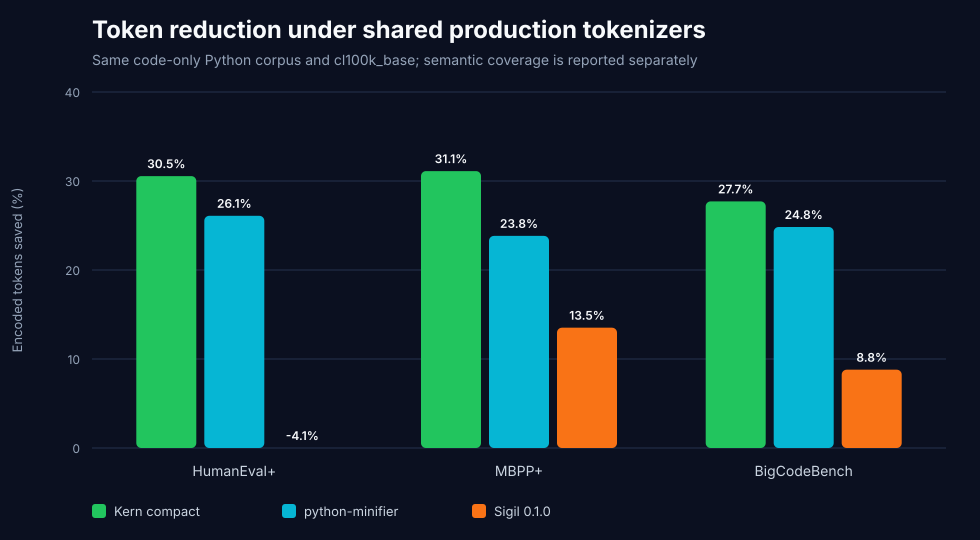
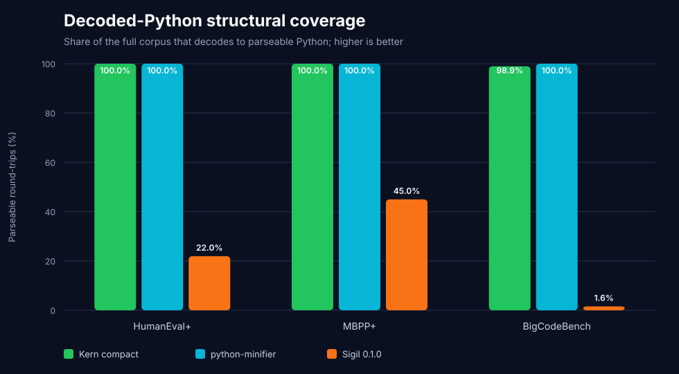
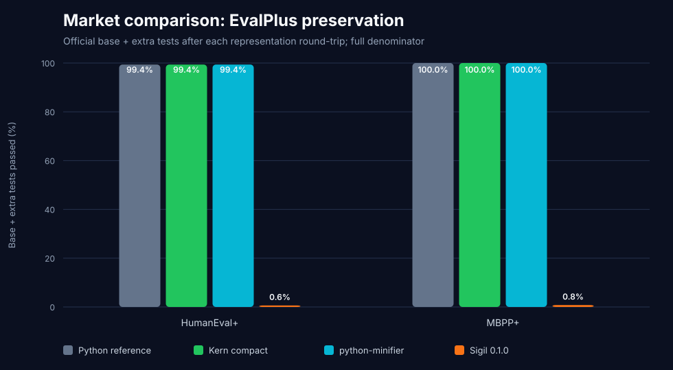
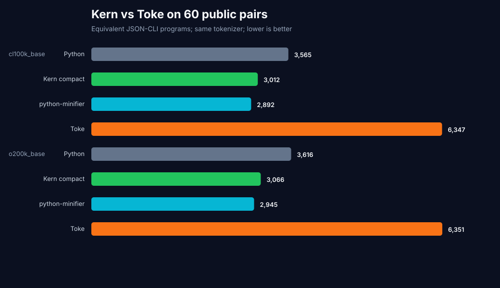
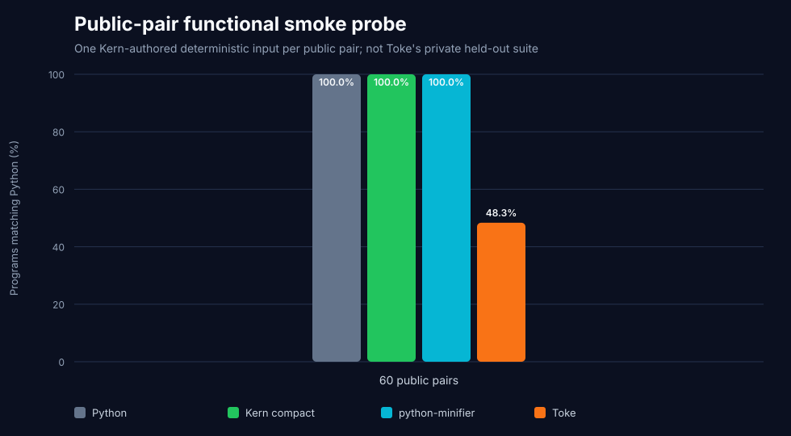
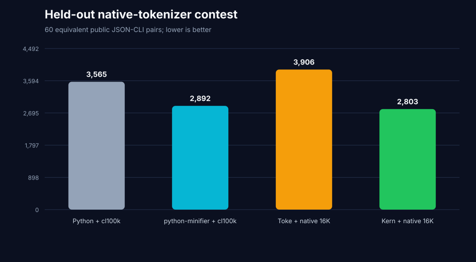
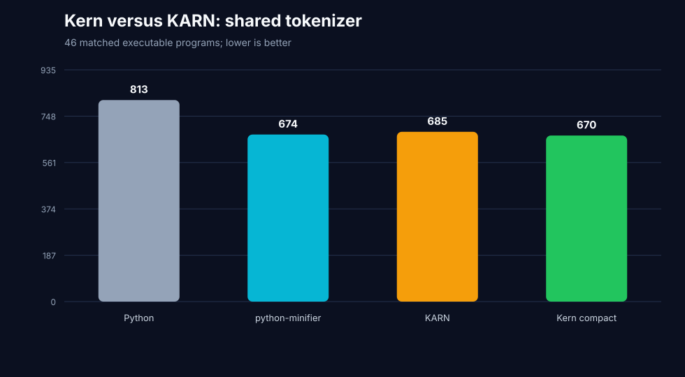
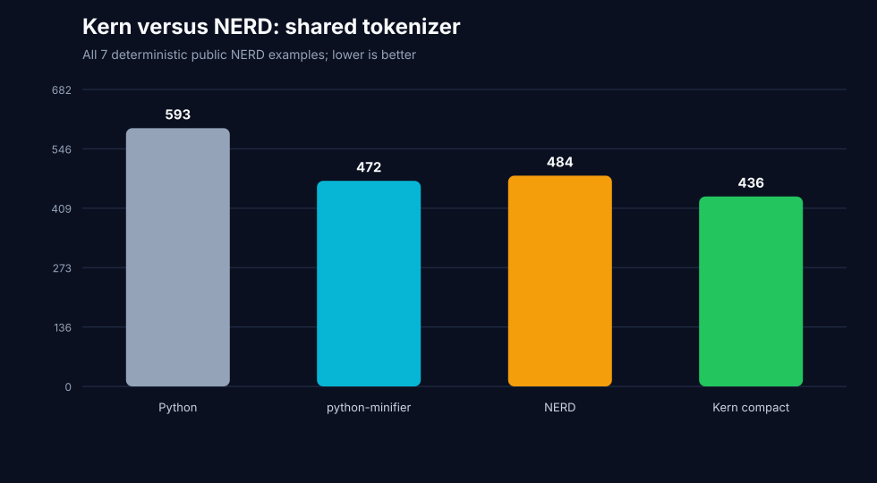

# Kern world-market benchmark — July 29, 2026

This is Kern's directly reproduced language-level market comparison. It does
**not** claim that Kern has already beaten every language. It establishes
audited results against Sigil and Toke—including an equal-vocabulary native
tokenizer win—paired audits of KARN and NERD, and the first executable screen
of K, GolfScript, and J, plus an explicit queue for the remaining contenders.

## Reproduced Sigil result

Kern v0.4 compact beats Sigil 0.1.0 under the shared production-tokenizer
protocol while preserving far more executable behavior.

All representations receive the same code-only canonical solutions:

- HumanEval+: 164;
- MBPP+: 378;
- BigCodeBench v0.1.4: 1,140;
- total: 1,682 programs.

The harness counts every encoded result, even when it cannot decode or execute.
Decode failures therefore cannot disappear from the token denominator.

### Token density

`cl100k_base` totals:

| Dataset | Python | Kern compact | python-minifier | Sigil 0.1.0 |
|---|---:|---:|---:|---:|
| HumanEval+ | `10,571` | **`7,342`** | `7,813` | `11,008` |
| MBPP+ | `15,183` | **`10,459`** | `11,565` | `13,130` |
| BigCodeBench | `163,786` | **`118,401`** | `123,107` | `149,382` |
| **Combined** | **`189,540`** | **`136,202`** | **`142,485`** | **`173,520`** |
| **Saved vs Python** | — | **`28.14%`** | **`24.83%`** | **`8.45%`** |

Kern compact uses `37,318` fewer `cl100k_base` tokens than Sigil (`21.51%`
below Sigil output). With `o200k_base`, Kern uses `139,556` tokens versus
Sigil's `176,043`, a difference of `36,487` (`20.73%` below Sigil).

Sigil expands HumanEval+ by `4.13%` under `cl100k_base`; its positive aggregate
result comes from `13.52%` savings on MBPP+ and `8.79%` on BigCodeBench.



### Structural coverage

| Representation | Fully converted | Decoded | Parseable Python | Contract AST |
|---|---:|---:|---:|---:|
| Kern compact | `1,682/1,682` | `1,682/1,682` | **`1,670/1,682`** | **`1,657/1,682`** |
| python-minifier | `1,682/1,682` | `1,682/1,682` | **`1,682/1,682`** | Diagnostic only |
| Sigil 0.1.0 | `892/1,682` | `282/1,682` | **`224/1,682`** | `0/1,682` strict AST |

Sigil's strict AST column is diagnostic, not its declared contract. Official
functional execution below is the stronger semantic evidence.



### Official EvalPlus execution

| Dataset | Python | Kern compact | python-minifier | Sigil 0.1.0 |
|---|---:|---:|---:|---:|
| HumanEval+ | `163/164` | **`163/164`** | `163/164` | `1/164` |
| MBPP+ | `378/378` | **`378/378`** | `378/378` | `3/378` |
| **Combined** | **`541/542`** | **`541/542`** | **`541/542`** | **`4/542`** |

Kern matches the Python reference outcome on all `542/542` tasks. The common
`HumanEval/32` numeric-oracle failure remains unchanged.



## What this proves

The evidence supports this bounded statement:

> On the pinned 1,682-program corpus with `cl100k_base` and `o200k_base`, Kern
> v0.4 compact is denser and substantially more reliable than the public Sigil
> 0.1.0 Python conversion pipeline.

The later paired sections reproduce KARN and NERD separately. None of these
source-representation results proves superiority over the compact-language
frontier or over model-generation systems.

## Reproduced Toke public-pair result

Toke does not publish a Python-to-Toke converter, so it requires a paired
protocol. The pinned public evaluation repository contains 60 Python reference
functions with matching Toke programs. The
[Toke report](../toke/README.md) renders both sides as equivalent JSON-CLI
programs and keeps all 60 pairs in the denominator.

| `cl100k_base` result | Python | Kern compact | python-minifier | Toke |
|---|---:|---:|---:|---:|
| Tokens | `3,565` | **`3,023`** | `2,892` | `6,347` |
| Saved vs Python | — | **`15.20%`** | `18.88%` | `-78.04%` |

Kern uses `3,324` fewer shared-tokenizer tokens than Toke (**`52.37%` below
Toke**). With Toke's own 16K BPE, the 60 Toke programs use `3,906` tokens; Kern
with cl100k still uses `22.61%` fewer, but that observation remains explicitly
cross-tokenizer until Kern has a held-out native-tokenizer lane.

Kern round-trips and matches the public smoke oracle on `60/60`. Only `29/60`
published Toke pairs pass the current pinned compiler, and all 29 pass the
single probe. Across all 1,000 published Toke solutions, `430/1,000` pass the
current compiler versus the historical public CSV's `588/923` evaluated
passes.





## Reproduced native-tokenizer result

Kern's purpose-built byte-level BPE is trained on exactly `25,953` valid Kern
programs from CodeSearchNet train, selected on a repository-disjoint validation
partition, and evaluated only on excluded final suites. Its vocabulary has
exactly `16,384` entries, matching Toke's official tokenizer.

| Held-out 60-pair system | Tokens |
|---|---:|
| **Kern compact + Kern‑16K** | **`2,870`** |
| python-minifier + cl100k | `2,892` |
| Python + cl100k | `3,565` |
| Toke + Toke‑16K | `3,906` |

Kern is **26.52% below Toke** in the equal-vocabulary native contest, wins
`47/60` individual pairs, and exactly reconstructs all 60 Kern sources. It
also closes the earlier aggregate 131-token shared-tokenizer micro-gap to
python-minifier when each system uses its production tokenizer.



Full training provenance, leakage controls, modern held-out results, artifacts,
and limitations are in the
[native-tokenizer report](../native-tokenizer/README.md).

## Reproduced KARN result

KARN v1.0.0 advertises 76% fewer tokens than Python. Its pinned public
repository does not publish the paired REST API sources, tokenizer, or counting
script behind the approximate `47`-versus-`198` example. The current short
README snippet uses `72` `cl100k_base` tokens, and the comment-free public API
server file uses `118`.

The reproducible lane uses 46 matched executable programs derived from KARN's
public examples and conformance features:

| Paired aggregate | Python | Kern compact | python-minifier | KARN |
|---|---:|---:|---:|---:|
| `cl100k_base` tokens | `813` | **`670`** | `674` | `685` |
| Exact interpreter output | `46/46` | **`46/46`** | `46/46` | **`46/46`** |

Kern is **2.19% smaller than KARN** with the same tokenizer. KARN's observed
reduction from the paired Python references is `15.74%`, not its unpublished
76% row. KARN's interpreter matches all 46 oracles, while its advertised
Python target preserves only `22/46`.

With each currently deployable language/tokenizer system, Kern‑16K uses `533`
tokens versus KARN + cl100k at `685`, a **22.19%** Kern advantage.



The exact sources, output oracles, failure details, claim audit, limitations,
and reproduction command are in the [KARN report](../karn/README.md).

## Reproduced NERD result

NERD 3.0.0 advertises 50–70% fewer tokens, while its public table shows two
smaller 32–33% reductions against Python. The pinned repository does not
publish the paired Python sources or name an LLM tokenizer. Its `nerd tokens`
command prints compiler lexer tokens.

The reproducible lane covers all seven deterministic local programs in pinned
commit `edeafd53c4282a322bfe882bab05e7890e4766fd`:

| Paired aggregate | Python | Kern compact | python-minifier | NERD |
|---|---:|---:|---:|---:|
| `cl100k_base` tokens | `593` | **`436`** | `472` | `484` |
| Exact interpreter output | `7/7` | **`7/7`** | `7/7` | **`7/7`** |

Kern is **9.92% smaller than NERD** with the same tokenizer. NERD reduces the
matched Python source by `18.38%`. The current four-function math definition
reproduces the table's `32` only as compiler lexer tokens; the current
FizzBuzz has `43` lexer tokens rather than the published `49`.

With each currently deployable language/tokenizer system, Kern‑16K uses `367`
tokens versus NERD + cl100k at `484`, a **24.17% Kern advantage**.



The exact source pairs, hashes, gates, claim-counter evidence, limitations, and
reproduction command are in the [NERD report](../nerd/README.md).

## Adversarial compact-language frontier

Direct LLM-oriented projects are not the whole market. The current
[code.golf all-hole bytes ranking](https://code.golf/rankings/langs/all/all/bytes)
puts K, GolfScript, and J first, second, and third. That ranking measures
human-optimized UTF‑8 bytes, not production LLM tokens, so it was used only to
select adversaries.

The first fixed screen now executes fourteen complete matched programs:

| Aggregate result | Kern compact | K | GolfScript | J |
|---|---:|---:|---:|---:|
| Shared `cl100k_base` | **`200`** | `206` | **`169`** | **`163`** |
| Deployable system lane | **`159`** | `206` | `169` | `163` |
| Exact outputs | **`14/14`** | `14/14` | `14/14` | `14/14` |

Kern beats K by `2.91%` with the same tokenizer but does not beat GolfScript
or J there. Kern-16K wins the bounded system aggregate by `22.82%`, `5.92%`,
and `2.45%`, respectively. Kern still loses the UTF-8 byte lane to all three.

The [complete compact-language report](../compact-languages/README.md)
publishes every source, category, hash, runtime gate, graph, and reproduction
command. Its authorship limitation is material: the competitor programs are
benchmark-authored and compact, not certified best-known expert solutions.
Kern also wins only `6/14` individual native-token pairs against GolfScript
and J, so this is a first screen rather than a global defeat claim.

The other newly identified direct contender is
[zerolang](https://github.com/vercel-labs/zerolang), a graph-first language for
agents that names token efficiency as a design goal. It requires separate
measurements for source density, compiler graph-inspection payloads, and
checked-edit loops; no matched token-density claim was located.

## Remaining world-market gates

The machine-readable registry is
[`competitors.json`](competitors.json). Current priority:

1. expert review and expansion of the K, GolfScript, and J sources;
2. Pyth, Jelly, Uiua, and BQN adversarial screens;
3. zerolang source/graph/edit-loop audit;
4. exact ShortCoder and Token Sugar method reproduction;
5. continued monitoring for KARN, NERD, Toke, Ax, and other public version
   changes, plus third-party reproduction.

NURL is not an immediate production-tokenizer leader: its own reproducible
report says it requires a median roughly `1.7x` Python's tokens across eight
matched algorithms. AI Native Lang remains a workflow DSL and requires a
domain-specific comparison rather than the general Python corpus.

No “world champion” claim is made while these gates remain open. For the later
generation phase, [CodeGolf Bench](https://arxiv.org/abs/2605.30394) is a
relevant 60-language concise-generation benchmark, but it must use the same
model, prompt, correctness tests, and attempt budget in every language.

## Reproduce

```bash
python -m venv .venv-market
.venv-market/bin/pip install -r market-benchmark-requirements.txt
.venv-market/bin/python benchmark_market.py --run-functional --parallel 8
```

Sigil's public wheel builds its Tree-sitter parser on first use, so a C compiler
is required and the first run can spend several minutes compiling that parser.
The separately pinned Toke benchmark and build commands are documented in the
[Toke report](../toke/README.md).

Artifacts:

- `market-benchmark-summary.json`: metadata, aggregates, functional results,
  failure counts, and bounded examples;
- `market-benchmark-details.csv`: every case and every gate;
- `market-token-efficiency.svg`: shared-tokenizer density;
- `market-structural-coverage.svg`: decoded parse coverage;
- `market-evalplus-correctness.svg`: official functional preservation.
- `../toke/`: public-pair Toke benchmark, raw results, and graphs.
- `../karn/`: paired KARN benchmark, claim audit, and compiler-target results.
- `../nerd/`: all deterministic NERD examples, claim-counter audit, and graphs.
- `../compact-languages/`: K, GolfScript, and J executable sources, runtime
  gates, results, and graphs.
