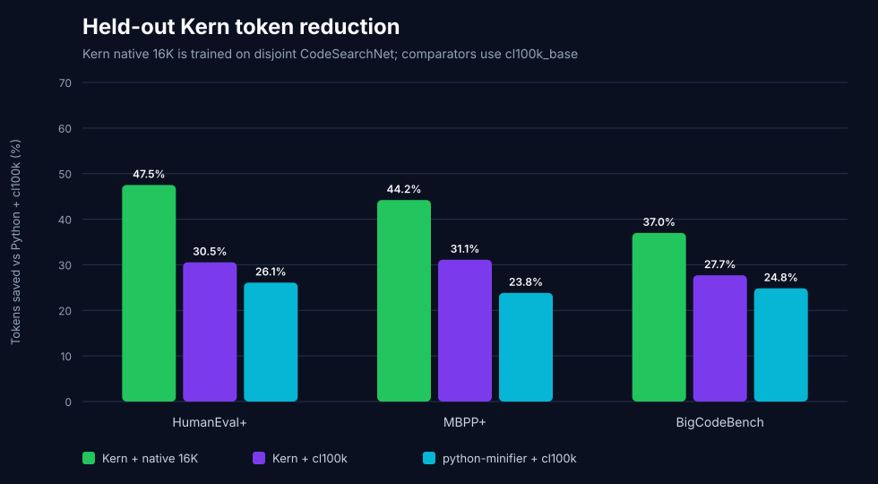

# Kern‑16K native-tokenizer benchmark — July 29, 2026

Kern now has a purpose-built, lossless 16K byte-level BPE and a held-out
native-tokenizer comparison against Toke. The central result is:

> On the 60 equivalent public JSON-CLI pairs excluded from Kern's tokenizer
> training, Kern compact + Kern‑16K uses **2,870 tokens** and Toke + its
> official 16K BPE uses **3,906 tokens**. Kern is **26.52% smaller**.

This closes the previously reported cross-tokenizer limitation. Both native
tokenizers have exactly `16,384` vocabulary entries, and each language is
scored with its own purpose-built tokenizer.

## Held-out Toke contest

| System | Tokens on 60 pairs | Relative to Python + cl100k |
|---|---:|---:|
| **Kern compact + Kern‑16K** | **`2,870`** | **`19.50%` smaller** |
| python-minifier + cl100k | `2,892` | `18.88%` smaller |
| Python + cl100k | `3,565` | baseline |
| Toke + official Toke‑16K | `3,906` | `9.56%` larger |

Kern uses `1,036` fewer native tokens than Toke. It wins `47/60` individual
pairs, and the median per-pair advantage is `21.05%`. Every Kern token stream
decodes to the exact input representation (`60/60`).

Kern‑16K also closes the small-program gap to python-minifier that the shared
tokenizer audit exposed: `2,870` versus `2,892` tokens, an aggregate lead of
`22` tokens (`0.76%` below the minified Python output). This is an
end-to-end system comparison—Kern uses its native tokenizer while
python-minifier uses `cl100k_base`.


## Modern held-out suites

The final evaluation also scores every code-only canonical program from
HumanEval+, MBPP+, and BigCodeBench. None is used to train the vocabulary or
choose the pre-tokenizer.

| Dataset | Programs | Python + cl100k | Kern + cl100k | Kern + Kern‑16K | Native saved vs Python |
|---|---:|---:|---:|---:|---:|
| HumanEval+ | `164` | `10,571` | `7,342` | **`5,550`** | **`47.50%`** |
| MBPP+ | `378` | `15,183` | `10,459` | **`8,471`** | **`44.21%`** |
| BigCodeBench | `1,140` | `163,786` | `118,401` | **`103,205`** | **`36.99%`** |
| **Combined** | **`1,682`** | **`189,540`** | **`136,202`** | **`117,226`** | **`38.15%`** |

Across all 1,682 programs, Kern‑16K removes another `18,976` tokens relative
to Kern under `cl100k_base` (`13.93%`) and uses `25,261` fewer tokens than
python-minifier + cl100k (`17.73%`). Exact tokenizer round-trip succeeds on
`1,682/1,682`.



## Training and leakage controls

The trainer uses the official CodeSearchNet Python Parquet files at revision
`bd0cf261e357a3eb5c8fba490d23ec1a1cd59555`.

- Training: exactly `25,953` valid Kern compact programs from the official
  `train` partition, matching Toke's published program count.
- Selection: `2,048` valid programs from the repository-disjoint official
  `validation` partition.
- Final evaluation: HumanEval+ `164`, MBPP+ `378`, BigCodeBench `1,140`, and
  the 60 public Toke/Python pairs.
- Before acceptance, each CodeSearchNet program must parse, transpile to Kern,
  compile back to Python, and match the expected compact normalized AST.
- Duplicate source, AST, and Kern hashes are rejected.
- Modern final programs are excluded by normalized-source and normalized-AST
  SHA-256. With the pinned toke-eval checkout, the 60 paired programs are
  excluded by both source and AST hashes.
- Raw CodeSearchNet source is not stored in this repository.

The selected tokenizer is byte-level BPE with byte fallback, no normalizer, a
ByteLevel decoder, a 64-byte maximum token length, and no-regex ByteLevel
pre-tokenization. Both candidates were lossless; the selected candidate used
`220,537` tokens on the selection corpus versus `291,819` for the regex
candidate.

The tokenizer artifact has SHA-256
`d570a49067b2fffca939924527b8daa3c0cc74e687b1ce7026c3193396e570ec`.
The manifest records dataset file hashes, corpus aggregate hashes, rejection
counts, package versions, selection metrics, and the exact tokenizer
configuration.

## Interpretation

The native paired lane supports this bounded claim:

> On the pinned 60-program public paired corpus, with equal 16K vocabulary
> sizes and each language using its own native tokenizer, Kern compact is
> 26.52% smaller than Toke and exactly reconstructs all 60 Kern sources.

It does not claim a model-generation Pass@1 result or reproduce Toke's private
tests. Functional behavior for these same public pairs remains the separately
reported deterministic smoke result: Kern matches `60/60`; the current pinned
Toke compiler accepts and matches `29/60`.

The shared `cl100k_base` lane remains useful as a tokenizer-neutral grammar
comparison. The native lane measures the complete language-plus-tokenizer
system that a future Kern-native model would use.

## Reproduce

```bash
git clone https://github.com/karwalski/toke-eval.git /tmp/toke-eval
git -C /tmp/toke-eval checkout 851f6d8b2cfedea22833f3787ad96c19e072e952

python -m venv .venv-native
.venv-native/bin/pip install -r native-tokenizer-requirements.txt

.venv-native/bin/python train_kern_tokenizer.py \
  --toke-eval /tmp/toke-eval

.venv-native/bin/python benchmark_native_tokenizer.py \
  --toke-eval /tmp/toke-eval
```

Artifacts:

- `kern-16k-tokenizer.json`: loadable lossless tokenizer;
- `kern-16k-training-manifest.json`: provenance and leakage controls;
- `native-tokenizer-summary.json`: aggregate results and pinned versions;
- `native-tokenizer-details.csv`: all 1,742 final-evaluation rows;
- `native-tokenizer-modern.svg`: held-out modern suites;
- `native-tokenizer-toke.svg`: equal-vocabulary native Toke contest.
