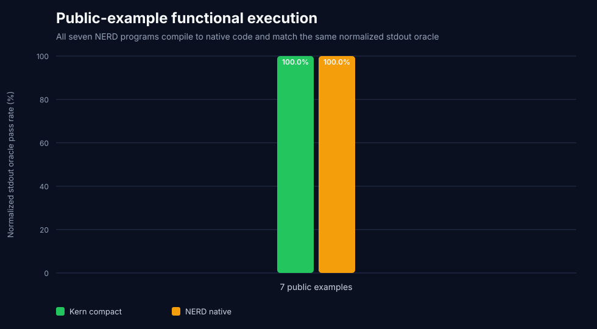

# Kern vs NERD 3.0.0 — public-example audit, July 29, 2026

NERD describes itself as an LLVM-backed intermediate language for machine
authorship and advertises 50–70% fewer tokens. Its public table reports `49`
NERD versus `73` Python tokens for FizzBuzz and `32` versus `47` for four math
functions, but does not name a tokenizer or publish the paired Python sources.

This audit pins NERD commit
`edeafd53c4282a322bfe882bab05e7890e4766fd` and evaluates every deterministic
local example shipped by that revision. The seven NERD sources are copied
exactly after removing full-line comments, paired with equivalent Python, and
measured under the same production tokenizers.

## Result

| Seven public programs | Python | Kern compact | python-minifier | NERD |
|---|---:|---:|---:|---:|
| `cl100k_base` tokens | `593` | **`436`** | `472` | `484` |
| `o200k_base` tokens | `595` | **`445`** | `474` | `484` |
| Exact output | `7/7` | **`7/7`** | `7/7` | **`7/7`** |

Kern compact uses `48` fewer `cl100k_base` tokens than NERD: **`9.92%` below
NERD**. Kern wins `5/7` individual shared-tokenizer pairs. NERD reduces the
matched Python references by `18.38%`, substantially less than its unqualified
50–70% headline.


## Complete-system observation

NERD does not publish a purpose-built LLM tokenizer. In the currently
deployable system lane, Kern compact + Kern‑16K uses `367` tokens while NERD +
`cl100k_base` uses `484`, a **`24.17%` Kern advantage**. This result is useful
for deployment planning but remains a cross-tokenizer comparison; the
shared-`cl100k_base` result above is the neutral source-language comparison.

Kern's native tokenizer exactly reconstructs all `7/7` Kern sources and the
decoded programs preserve the expected compact AST on `7/7`.

## Functional preservation

| Gate | Passing programs |
|---|---:|
| Python oracle | `7/7` |
| Kern decoded-Python oracle | `7/7` |
| python-minifier oracle | `7/7` |
| NERD parser | `7/7` |
| NERD native compile/run | `7/7` |
| NERD normalized stdout oracle | `7/7` |

NERD's current compiler is functional on the complete deterministic local
example set. Numeric output normalization only equates whole-line forms such
as `5.0` and `5`; arbitrary text is not changed.



## Public-claim audit

The command `nerd tokens` prints the compiler's lexical token stream. It does
not call `tiktoken` or another LLM tokenizer:

- the current FizzBuzz source uses `60` `cl100k_base` tokens and `43` compiler
  lexer tokens, so the published NERD count of `49` no longer reproduces;
- the current four-function math definitions use `39` `cl100k_base` tokens
  and `32` compiler lexer tokens, exactly reproducing the table's NERD `32`;
- no `cl100k`, `tiktoken`, or equivalent tokenizer reference exists in the
  pinned repository;
- the Python sources behind the published `73` and `47` values are absent.

The evidence is therefore consistent with an asymmetric table: NERD compiler
tokens on one side and an unstated count over unpublished Python on the other.
That table cannot support a production-token claim until the exact paired
sources and one common tokenizer are published.

## Scope and limitations

- The denominator is all seven deterministic local examples: calculator,
  conditionals, FizzBuzz, functions, loops, math, and output.
- Network-dependent agent, HTTP, JSON, LLM, and MCP examples are excluded
  because they require external services and do not provide deterministic
  local stdout oracles.
- This is a source-representation and compiler-preservation benchmark, not an
  LLM generation or Pass@1 benchmark.
- Seven small examples cannot establish general market leadership. The result
  only closes NERD's currently public deterministic program surface.
- NERD's `make test` gate passes, but the target only tokenizes, parses, and
  compiles `examples/math.nerd`; it is a smoke gate rather than a unit suite.

## Reproduce

```bash
git clone https://github.com/Nerd-Lang/nerd-lang-core.git /tmp/nerd
git -C /tmp/nerd checkout edeafd53c4282a322bfe882bab05e7890e4766fd
make -C /tmp/nerd/bootstrap

python -m venv .venv-market
.venv-market/bin/pip install -r native-tokenizer-requirements.txt
.venv-market/bin/python benchmark_nerd.py --nerd-root /tmp/nerd
```

The harness refuses a different NERD commit, compiler version, changed public
source, or changed Kern tokenizer digest.

## Artifacts

- `nerd-benchmark-summary.json`: metadata, claim audit, gates, aggregates, and
  failure stages;
- `nerd-pair-corpus.json`: exact paired sources, expected stdout, and hashes;
- `nerd-benchmark-details.csv`: per-program token counts and every gate;
- `nerd-token-density.svg`: shared and complete-system token counts;
- `nerd-functional-preservation.svg`: full-denominator execution results.
