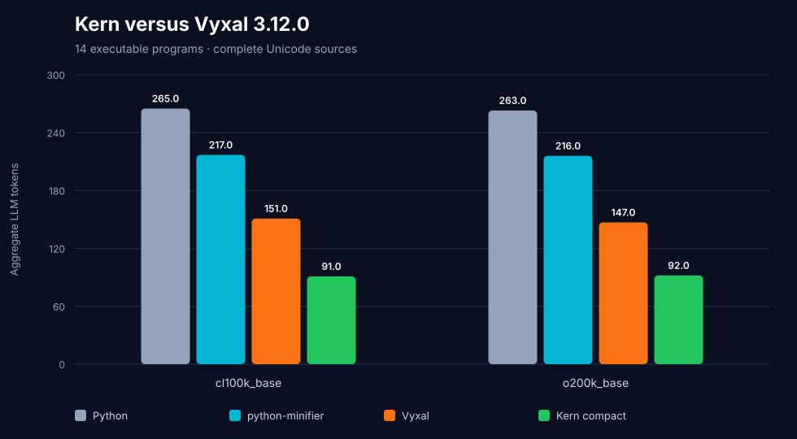
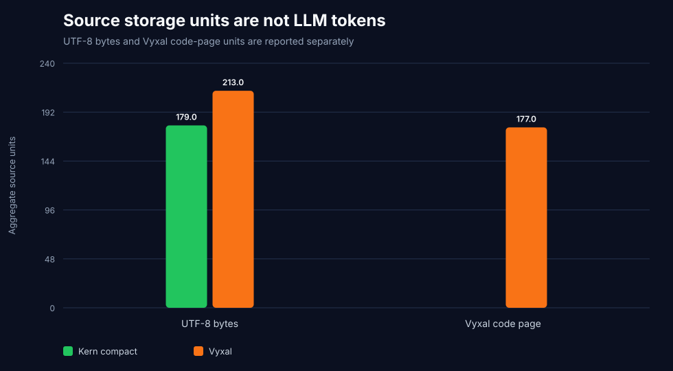
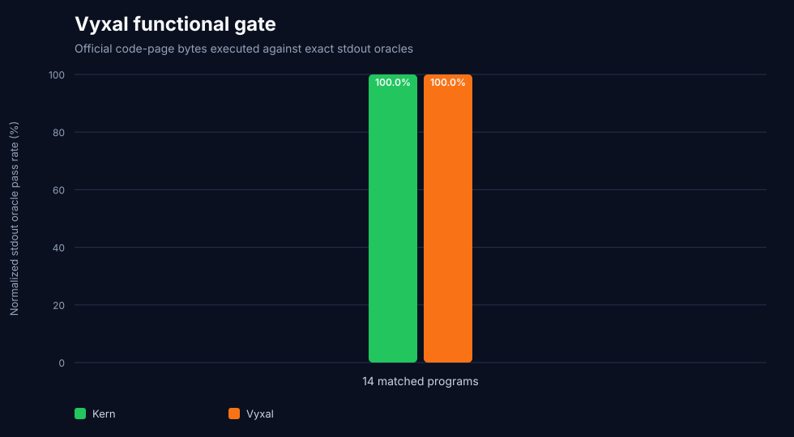

# Kern versus Vyxal 3.12.0 — August 1, 2026

[Vyxal](https://github.com/Vyxal/Vyxal) is a modern stack-based golfing and
array language. This audit promotes it from Kern's research queue to an
executable, pinned competitor.

The result is deliberately bounded: fourteen complete programs, one exact
stdout oracle per program, and sources that are compact but not claimed to be
globally minimal.

## Result

| Complete-source aggregate | Kern compact | Vyxal 3.12.0 |
|---|---:|---:|
| `cl100k_base` | **`91`** | `151` |
| `o200k_base` | **`92`** | `147` |
| Deployable tokenizer lane | **`99` Kern-16K** | `151` cl100k |
| UTF-8 bytes | **`179`** | `213` |
| Exact normalized stdout | **`14/14`** | **`14/14`** |

Kern uses `60` fewer `cl100k_base` tokens, a bounded reduction of **39.74%**
against Vyxal. Under `o200k_base`, Kern uses `55` fewer tokens (**37.41%**).



The per-program result is less one-sided and is published to avoid hiding
corpus shape: Kern wins `6/14`, Vyxal wins `5/14`, and `3/14` tie under
`cl100k_base`. Kern's aggregate lead comes primarily from list literals and
array tasks; Vyxal is especially strong on factorial, range sum, GCD, counting,
and mapped squares.

## The code-page lane is separate

Vyxal ships an official 256-character one-byte code page. All fourteen Vyxal
programs were encoded into those bytes, decoded exactly, and executed with the
release JAR's `--bytes` mode.

| Storage accounting | Kern compact | Vyxal |
|---|---:|---:|
| UTF-8 bytes | **`179`** | `213` |
| Vyxal code-page units | not applicable | `177` |

The `177` code-page units are a legitimate Vyxal golf/storage score, but they
are **not** `cl100k_base`, `o200k_base`, or model-context tokens. They are never
substituted into the shared LLM-token leaderboard.



## Runtime and correctness gates

- official release: [Vyxal v3.12.0](https://github.com/Vyxal/Vyxal/releases/tag/v3.12.0);
- source commit: `7f201806cde2a1fafdca054ac398be36f939c273`;
- release JAR SHA-256:
  `f50af719c56374534216912887097959e8cc58dd8622491c0a246f8479cb7615`;
- official code-page SHA-256:
  `04773c1e2df06bf6af244473ba06411cbf9bfba1131b87bd92f6c26847f5b624`;
- Vyxal code-page round-trip: `14/14`;
- Python, python-minifier, Kern, and Vyxal stdout: `14/14` each;
- Kern compact AST contract and Kern-16K exact token round-trip: `14/14`.



## Protocol and limitations

The corpus is the same fixed registry used by the K/GolfScript/J,
Pyth/Jelly, Uiua/BQN, and GNU APL/CJam/Kona screens. It contains six array,
three text, two scalar, two reduction, and one recurrence program.

Every complete Unicode source is counted with the same production tokenizer.
Vyxal is additionally executed from its official code-page bytes. Normalized
stdout collapses display-only whitespace while preserving values and order.

These are benchmark-authored sources using documented Vyxal primitives. Expert
golfers may find shorter programs, and the small array-heavy corpus can change
the aggregate ordering. This report proves a reproducible first screen—not a
claim that Kern has exhausted Vyxal or every code-golf language.

## Reproduce

A compatible Java runtime (Java 17 was used here) and the benchmark
environment are required:

```bash
mkdir -p external/Vyxal
gh release download v3.12.0 \
  --repo Vyxal/Vyxal \
  --pattern vyxal-3.12.0.jar \
  --dir external/Vyxal
shasum -a 256 external/Vyxal/vyxal-3.12.0.jar
.venv/bin/python benchmark_vyxal.py
```

Artifacts:

- `vyxal-corpus.json`: every Python and Vyxal source plus stdout oracle;
- `vyxal-details.csv`: per-program hashes, tokens, bytes, code-page units,
  structural checks, and oracle results;
- `vyxal-summary.json`: pins, runtime evidence, aggregate results, and category
  splits;
- `vyxal-token-density.svg`, `vyxal-system-lane.svg`,
  `vyxal-source-units.svg`, and `vyxal-functional.svg`: visual results.
